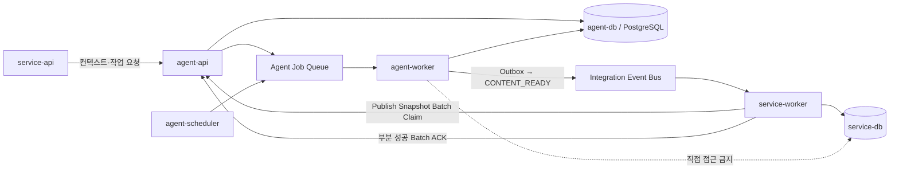
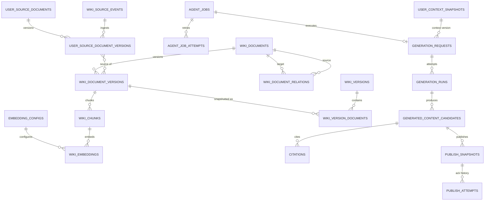
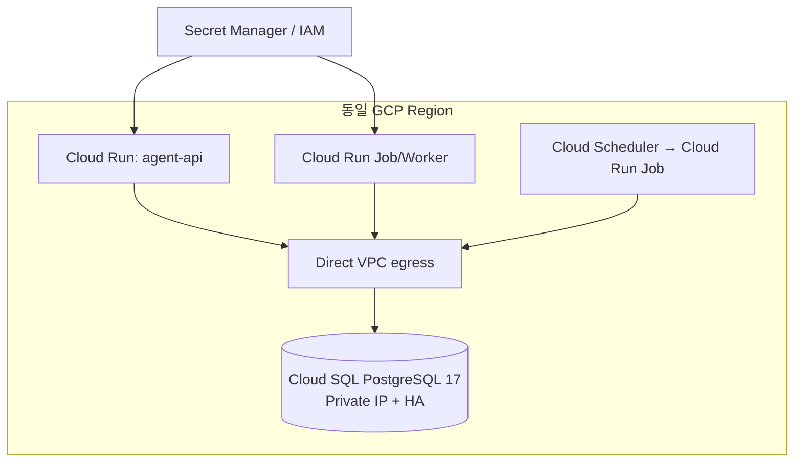

# Agent DB PostgreSQL 설계

테이블 43개의 영역·성격·관계·RLS·런타임 연결 상태는
[Agent DB 테이블 카탈로그](agent-db-table-catalog.md)에서 확인합니다.
각 컬럼의 타입·필수 여부·기본값·의미는
[Agent DB 컬럼 사전](agent-db-column-dictionary.md)에서 확인합니다.

이 문서는 Bambi Agent API가 소유하는 `agent-db`의 데이터 경계, PostgreSQL 스키마, 로컬 Docker 구성과 GCP 배포 기준을 정의합니다. 기준 자료는 공유된 [최종 아키텍처 draw.io 문서](https://drive.google.com/file/d/1ZiZlTIQxpaYKiAtoWMzPwfUuwpW9bI7Z/view?usp=sharing), `agent-api-feature-spec.md`, `agent-api-mvp-scope.md`, `fastapi-mvp-api.md`입니다.

## 1. 설계 결정

| 항목 | 결정 |
|---|---|
| 데이터베이스 | PostgreSQL 17 |
| Vector 저장 | 동일 PostgreSQL의 pgvector, MVP Embedding 차원은 1536 |
| 논리 Schema | `agent` 한 개. `public`에는 Extension만 설치 |
| 내부 ID | Agent가 생성하는 Entity는 UUID |
| 경계 ID | `user_id`, `content_id`, `source_event_id` 등 Service 소유 ID는 `text`, service-db 외래키 금지 |
| 개인 지식 격리 | `namespace_key = user/{user_id}`, RLS와 애플리케이션 사용자 조건을 함께 적용 |
| Global 지식 | `namespace_key = global`, 사용자는 읽을 수 있고 시스템 Scope만 쓸 수 있음 |
| 검색 | pgvector Cosine HNSW + PostgreSQL FTS + `pg_trgm` Hybrid Search |
| 원문·Asset | 웹 클리핑 Markdown은 DB에 보존하고 대용량 HTML·PDF·Binary는 GCS URI만 저장 |
| 이벤트 | Transactional Outbox와 Consumer Inbox로 멱등성 경계 제공 |
| 로컬 | Docker Compose의 PostgreSQL 17 + pgvector |
| GCP | Cloud SQL for PostgreSQL 17, Private IP, Cloud Run/Worker와 동일 Region |

PostgreSQL 17을 선택한 이유는 로컬과 Cloud SQL의 Major Version을 맞추면서 현재 Cloud SQL에서 pgvector를 지원하기 때문입니다. Cloud SQL은 설치 가능한 Extension을 제한하므로 배포 전에 [지원 Extension 목록](https://docs.cloud.google.com/sql/docs/postgres/extensions)을 확인해야 합니다. 로컬 이미지는 [pgvector 공식 Docker 이미지](https://github.com/pgvector/pgvector#docker)를 사용합니다.

## 2. 데이터 소유권 경계

공유 아키텍처의 가장 중요한 원칙은 `service-db`와 `agent-db`의 물리적·논리적 분리입니다.

- `service-db` 소유: Bookmark, 확정된 Card/Feed, Like/Comment/Follow, 권한과 관리자 감사 정보
- `agent-db` 소유: Agent에 제출된 클리핑 원본, AI 최소 사용자 컨텍스트, 생성된 Wiki/Chunk/Embedding, 관심사 추론, Prompt/Model/Retrieval 설정, Agent Job, 생성 후보, Citation, 사용량과 Agent 감사 로그
- `agent-api`, `agent-worker`, `agent-scheduler`만 `agent-db`에 접근합니다.
- Agent 계층은 `service-db`에 직접 접근하지 않습니다.
- 사용자 원본 변경은 Service API 호출이나 Integration Event로 전달합니다.
- 생성 후보는 `CONTENT_READY` Event와 Lease 기반 Publish Snapshot Batch Claim으로 Service Worker에 전달하며, Service Worker만 `service-db`에 발행합니다.



## 3. 핵심 Entity 관계

MVP의 주요 데이터 흐름만 표시한 관계도입니다. 전체 보조 테이블은 초기 Migration에 포함되어 있습니다.



## 4. 기능 명세와 Table 매핑

| 기능 ID | 책임 | Table |
|---|---|---|
| DB-001 | 사용자 컨텍스트 저장 | `user_context_snapshots` |
| DB-002 | Wiki Source Event·사용자 원본 저장 | `wiki_source_events`, `user_source_documents`, `user_source_document_versions` |
| DB-003 | 개인 LLM Wiki 문서 저장과 원본·문서 관계 추적 | `wiki_documents`, `wiki_document_versions`, `wiki_document_sources`, `wiki_document_relations` |
| DB-004 | 개인 Wiki Chunk 저장 | `wiki_chunks` |
| DB-005 | 개인 Wiki Embedding 저장 | `wiki_embeddings` |
| DB-006 | 개인 Wiki Build Version과 구성 문서 저장 | `wiki_versions`, `wiki_version_documents` |
| DB-007 | 사용자 관심사 저장 | `user_interest_profiles`, `user_interests`, `interest_evidence` |
| DB-008 | Global Source 저장 | `global_sources` |
| DB-009 | Global Collection Run 저장 | `global_collection_runs` |
| DB-010 | Global 문서 저장 | `wiki_documents`, `wiki_document_versions`의 `global` Namespace |
| DB-011 | Global Chunk 저장 | `wiki_chunks`의 `global` Namespace |
| DB-012 | Global Embedding 저장 | `wiki_embeddings`의 `global` Namespace |
| DB-013 | Global Trend 저장 | `global_trends`, `global_trend_documents` |
| DB-014 | Discovery Candidate 저장 | `discovery_candidates` |
| DB-015 | Generation Request 저장 | `generation_requests` |
| DB-016 | Generated Content 저장 | `generation_runs`, `generated_content_candidates` |
| DB-017 | Citation 저장 | `citations` |
| DB-018 | Content Asset 저장 | `content_assets` |
| DB-019 | Quality Evaluation 저장 | `quality_evaluations` |
| DB-020 | Safety Evaluation 저장 | `safety_evaluations` |
| DB-021 | Recommendation Candidate 저장 | `recommendation_candidates` |
| DB-022 | Prompt 저장 | `prompt_templates`, `prompt_versions` |
| DB-023 | Model Config 저장 | `model_configs` |
| DB-024 | Retrieval 설정 저장 | `retrieval_configs` |
| DB-025 | Embedding 설정 저장 | `embedding_configs` |
| DB-026 | Agent Job 저장 | `agent_jobs`, `agent_job_attempts` |
| DB-027 | Event Outbox 저장 | `event_outbox`, `event_inbox` |
| DB-028 | API Key 저장 | `api_keys` |
| DB-029 | Usage Log 저장 | `usage_logs` |
| DB-030 | Audit Log 저장 | `audit_logs` |

`publish_snapshots`와 `publish_attempts`는 PUB-001~010 및 SW-004/009의 Version, Hash, Batch Claim Lease와 ACK 이력을 담당합니다.

## 5. 주요 모델링 규칙

### ID와 Version

- Service 계층이 소유한 ID는 형식을 추정하지 않고 `text`로 저장합니다.
- Agent 내부 Entity는 `gen_random_uuid()`로 생성합니다.
- Context, Wiki, Prompt, Model Config, 생성 콘텐츠는 덮어쓰지 않고 Version Row를 추가합니다.
- `context_version`, `source_event_id`, `idempotency_key`, `content_id + version`에 Unique 제약을 둡니다.
- Publish Snapshot Hash는 현재 FastAPI 계약과 동일하게 불투명 문자열로 보존하고 Version과 함께 검증합니다.

### Personal과 Global 지식

Agent가 만든 `wiki_documents`, `wiki_document_versions`, `wiki_chunks`, `wiki_embeddings`는 같은 구조를 재사용하되 `namespace_key`로 검색 범위를 분리합니다. 사용자가 제출한 원본은 `user_source_documents` 계열에만 저장합니다.

- 개인 Wiki: `knowledge_scope = personal`, `namespace_key = user/{user_id}`
- Global Source: `knowledge_scope = global`, `namespace_key = global`
- 자동 수집 Global 문서는 사용자의 선택 없이 Personal Namespace로 이동하지 않습니다.
- Personal LLM Wiki 문서 삭제 시 Version → 출처 연결·Chunk → Embedding 순서가 Foreign Key Cascade로 정리됩니다. 사용자 원본은 별도 삭제 요청 전까지 영향을 받지 않습니다.

### Obsidian LLM Wiki Vault 구조

Personal LLM Wiki의 Entity, Concept, Schema는 서로 다른 Table이 아니라
`wiki_documents`의 논리 문서 Row로 저장합니다. Markdown 변경은 같은
`document_id`에 `wiki_document_versions` Row를 추가하는 방식으로 보존합니다.

| document_kind | 기본 경로 | 생성·갱신 기준 |
|---|---|---|
| `entity` | `entities/{document_key}.md` | 서로 다른 구체 대상당 한 문서. 같은 Key는 새 Row 대신 새 Version 생성 |
| `concept` | `concepts/{document_key}.md` | 둘 이상 Entity가 공유하는 설계 패턴당 한 문서 |
| `schema` | `schema/schema.md` | Namespace당 항상 하나만 유지하고 Entity·관계 변경 시 새 Version 생성 |
| `document` | `documents/{document_key}.md` | 0005 이전 문서와 구조화되지 않은 일반·Global 문서 호환 유형 |

- `document_key`는 문서 내용이 변경되어도 같은 논리 대상을 찾는 Upsert Key입니다.
- `file_path`는 Obsidian으로 내보낼 Vault 경로이며 Namespace 내 활성 문서 사이에서 Unique합니다.
- `source_type`은 클리핑·RSS·Agent 생성 등 유입 경로이므로 Entity·Concept·Schema 구분에 사용하지 않습니다.
- YAML Frontmatter를 포함한 완성 Markdown은 `wiki_document_versions.normalized_content`에 저장해 Vault 파일로 손실 없이 내보냅니다.
- `wiki_document_relations`는 Entity 관계, Concept 적용, Concept 간 관계와 별칭을 구조화합니다. 관계 설명·Cardinality는 Metadata에 보존합니다.
- 각 `wiki_versions` Build는 `wiki_version_documents`로 정확한 문서 Version과 당시 파일 경로를 고정해 해당 시점의 Vault를 재구성할 수 있게 합니다.

Concept의 2개 이상 Entity 공유, 기존 Concept과 70% 이상 중복, 실질적 설계
이유 포함 여부는 의미 판단이므로 DB Check 제약이 아니라 Worker 정책으로
검증합니다. DB는 판단 결과의 안정적 식별, Namespace 격리와 이력 복원을
담당합니다.

### 웹 클리핑 Markdown

웹 클리퍼가 전달하는 YAML Frontmatter와 Markdown 본문은 `user_source_document_versions`에 원본으로 보존합니다. HTML 원문을 다시 저장하지 않으며, LLM Wiki·Chunk·Embedding 생성 후에도 Markdown은 사용자가 저장한 기준 원문으로 유지합니다.

| 클리퍼 필드 | 저장 위치 |
|---|---|
| `title` | `user_source_document_versions.title` |
| `source` | `user_source_documents.canonical_url` |
| `author` | `user_source_document_versions.author` |
| `published` | `user_source_document_versions.published_at` |
| `created` | `user_source_document_versions.clipped_on` |
| `description` | `user_source_document_versions.description` |
| `tags` | `user_source_document_versions.tags` |
| Markdown 본문 | `user_source_document_versions.raw_content` |

`wiki_source_events`는 클리핑 요청의 멱등성, 처리 상태와 최소 수신 Metadata만 보관합니다. Worker는 원본 Version ID로 Job을 처리해 `document_kind + document_key`로 `wiki_documents`를 Upsert하고, 새 `wiki_document_versions`와 `wiki_document_sources`를 생성합니다. `0004_separate_user_sources_from_llm_wiki.sql`은 0003에서 Wiki Version으로 저장했던 기존 개인 클리핑을 원본 테이블로 이관하고, Wiki Version에서 Frontmatter 전용 컬럼을 제거합니다. `0005_structure_llm_wiki_documents.sql`은 Wiki 파일 식별·문서 Graph·Build Snapshot 구조를 추가합니다.

### Hybrid Search와 Vector

- 의미 검색: `wiki_embeddings.embedding vector(1536)`과 Cosine HNSW Index
- 일반 FTS: `wiki_chunks.search_vector`의 GIN Index
- 한국어 및 다국어 부분 일치: `wiki_chunks.content`의 `pg_trgm` GIN Index
- 검색 시 반드시 `namespace_key IN ('global', 'user/{user_id}')` 조건을 먼저 적용합니다.
- MVP의 Embedding 차원은 1536으로 고정합니다. 다른 차원의 모델을 활성화할 때는 기존 Column을 혼용하지 않고 별도 Migration과 Index를 추가합니다.

Cloud SQL의 pgvector는 ANN Index를 지원하며 HNSW 예시는 [Cloud SQL Vector 문서](https://docs.cloud.google.com/sql/docs/postgres/generate-manage-vector-embeddings)에 설명되어 있습니다. 데이터가 작을 때는 Filter가 적용된 Exact Search가 더 단순할 수 있으므로 실제 Query Plan과 Recall을 측정한 뒤 HNSW Parameter를 조정합니다.

### RLS와 최소 권한

RLS는 애플리케이션의 `WHERE user_id = ...`를 대체하지 않고 실수에 대비한 두 번째 방어선입니다.

```sql
BEGIN;
SET LOCAL app.user_id = 'user-123';
SET LOCAL app.access_scope = 'user';
SELECT *
FROM agent.wiki_documents
WHERE namespace_key IN ('global', 'user/user-123');
COMMIT;
```

- Production Runtime Role은 Table Owner가 아니어야 합니다. PostgreSQL Table Owner는 기본적으로 RLS를 우회할 수 있습니다.
- 사용자 Scope는 자신의 Personal Row와 Global 지식만 읽습니다.
- Scheduler, Global Collector, Migration은 별도 Service Account/DB Role을 사용합니다.
- `system` Scope는 일반 API 요청에서 설정할 수 없고 Worker 내부 경계에서만 사용합니다.
- API Key 원문과 Provider Secret은 DB에 저장하지 않습니다. Hash 또는 Secret Manager Resource Name만 저장합니다.

### Job과 Event 멱등성

- `agent_jobs`: `feature_id + user_id + idempotency_key` Unique Index로 중복 Job을 차단합니다.
- `agent_job_attempts`: 재시도마다 불변 실행 이력을 추가합니다.
- `event_outbox`: Agent DB 변경과 Event 생성을 같은 Transaction에서 Commit합니다.
- `event_inbox`: Consumer별 `event_id` Unique 제약으로 중복 처리를 차단합니다.
- 반복 실패는 `dead_letter` 상태로 분리하고 원본 Payload와 오류를 보존합니다.

### Agent Job Batch Claim

- Scheduler는 생성 대상자를 작은 묶음으로 순회하되 `schedule window + user_id + content_type`을 포함한 멱등성 키로 사용자별 Job을 독립 등록합니다.
- Worker는 하나의 짧은 Transaction에서 실행 가능한 Job을 `priority, scheduled_at, created_at` 순으로 조회하고 `FOR UPDATE SKIP LOCKED LIMIT :batch_size`로 Batch Claim합니다.
- Claim 시 `status = running`, `locked_by`, `locked_at`, `lease_expires_at`을 함께 갱신합니다. `lease_expires_at`은 기존 `0001_initial.sql`을 수정하지 않고 `0002_publish_snapshot_batches.sql`에서 `agent_jobs`에 추가합니다.
- DB Transaction은 Claim 직후 종료하고 검색·LLM 호출·콘텐츠 생성은 Transaction 밖에서 실행합니다. 장시간 Transaction으로 Connection과 Row Lock을 점유하지 않습니다.
- Claim Batch 크기와 실제 Job·LLM 호출 동시성은 독립 설정입니다. 예를 들어 여러 Job을 미리 점유하더라도 Provider Rate Limit과 비용 Budget에 맞춰 더 작은 동시성으로 실행합니다.
- Worker Heartbeat가 Lease를 갱신하며, 프로세스 종료나 Heartbeat 유실로 Lease가 만료된 Job은 재시도 정책에 따라 다시 `queued`로 전환합니다.
- 각 Job은 독립적인 `agent_job_attempts` Row와 결과 Transaction을 가지며 한 Job의 실패가 같은 Batch의 다른 Job을 Rollback하지 않습니다.

### Publish Snapshot Batch Claim과 ACK

MVP의 실시간·대량 발행 경로는 Agent API가 agent-db를 직접 노출하지 않고 Service Worker에 전체 Snapshot Payload를 Batch로 전달하는 Pull 계약을 사용합니다.

- Service Worker는 `POST /internal/v1/publish-snapshot-batches/claim`으로 처리 가능한 Snapshot을 Claim합니다.
- Agent API는 `status = ready`이고 `next_attempt_at IS NULL OR next_attempt_at <= now()`인 Row와, `status = claimed`이지만 Lease가 만료된 Row를 `created_at, id` 순으로 `FOR UPDATE SKIP LOCKED` 선택합니다.
- 선택된 Row는 하나의 `batch_id`를 공유하고 `status = claimed`, `claimed_by`, `lease_expires_at`을 원자적으로 기록합니다.
- Service Worker는 각 항목을 `content_id + version`으로 service-db에 독립적으로 멱등 Upsert하고 Commit이 끝난 결과만 Batch ACK에 포함합니다.
- `published` ACK는 Snapshot을 `published`로 전환합니다. 재시도 가능한 실패는 Exponential Backoff를 적용한 `next_attempt_at`과 함께 `ready`로 되돌리고, 재시도 불가능하거나 최대 횟수를 넘긴 실패는 `failed`로 전환합니다.
- ACK되지 않은 항목과 처리 중 Worker가 종료된 항목은 Lease 만료 후 다시 Claim할 수 있습니다. 동일 `batch_id + snapshot_id` ACK는 이전 결과를 반환하고 이력을 중복 생성하지 않습니다.
- `CONTENT_READY` Event는 Service Worker의 Poll을 즉시 깨우는 신호이며, 주기적인 Batch Poll은 이벤트 유실·장애 복구·Backfill 경로로 계속 유지합니다.
- 기존 단건 Snapshot 조회와 ACK는 수동 복구 및 개별 재발행 경로로 유지합니다.

`0002_publish_snapshot_batches.sql`은 기존 적용 Migration을 수정하지 않고 아래 변경을 추가합니다.

| Table | 변경 |
|---|---|
| `agent_jobs` | `lease_expires_at timestamptz` 추가 및 Claim 가능 Job 조회 Index 추가 |
| `publish_snapshots` | 상태에 `claimed` 추가, `claim_id uuid`, `claimed_by text`, `lease_expires_at timestamptz`, `attempt_count integer`, `next_attempt_at timestamptz` 추가 |
| `publish_attempts` | `claim_id uuid`, `claimed_by text`, `lease_expires_at timestamptz`, `retryable boolean` 추가 및 `snapshot_id + claim_id` 멱등성 제약 추가 |

`publish_snapshots`의 Batch Claim Index는 `status`, `next_attempt_at`, `created_at`, `id` 순서를 기본으로 하고 실제 Query Plan을 측정해 조정합니다. 단건·Batch ACK는 Snapshot 상태 변경과 `publish_attempts` 추가를 같은 Transaction에서 Commit합니다.

## 6. 로컬 Docker

루트 `compose.yaml`은 `pgvector/pgvector:0.8.1-pg17-bookworm`을 `127.0.0.1`에만 노출합니다. 비밀번호는 파일에 기본값으로 넣지 않으며 `.env`의 `AGENT_DB_PASSWORD`가 없으면 Compose가 시작되지 않습니다.

초기화와 검증 절차는 `database/README.md`를 따릅니다. 빈 Volume과 기존 Volume 모두 Compose `post_start` Initializer가 `schema_migrations`에 없는 SQL과 Checksum이 변경된 개발 Seed를 자동 적용합니다. 적용된 Migration 파일은 수정하지 않고 Schema 변경은 반드시 다음 순번 Migration으로 추가합니다.

## 7. GCP 배포

### 권장 Topology



- Cloud Run과 Cloud SQL은 같은 Region에 둡니다. Google도 지연, 네트워크 비용, 교차 Region 장애 위험을 줄이기 위해 동일 Region을 권장합니다. 자세한 연결 방식은 [Cloud Run에서 Cloud SQL 연결](https://docs.cloud.google.com/sql/docs/postgres/connect-run)을 참고합니다.
- Public IP와 Authorized Network 대신 Private IP와 Direct VPC egress를 기본으로 합니다. Private IP는 Private Services Access 구성이 필요합니다. [Cloud SQL Private IP 문서](https://docs.cloud.google.com/sql/docs/postgres/private-ip)
- Application과 Worker는 Cloud SQL Connector의 Automatic IAM Database Authentication을 사용합니다. Google은 장기 실행 및 Connection Pooling 애플리케이션에서 수동 Token 인증보다 자동 IAM 인증을 강하게 권장합니다. [Cloud SQL IAM 인증](https://docs.cloud.google.com/sql/docs/postgres/iam-authentication)
- Production은 Regional HA를 사용하고, 개발/검증 환경은 비용을 고려해 Zonal Instance를 사용할 수 있습니다. Regional HA는 두 Zone의 Disk에 동기 복제합니다. [Cloud SQL HA](https://docs.cloud.google.com/sql/docs/postgres/high-availability)
- Automated Backup과 Point-in-time Recovery를 활성화합니다. [Cloud SQL PITR](https://docs.cloud.google.com/sql/docs/postgres/backup-recovery/configure-pitr)

### DB Role

| Role | 용도 | 권한 |
|---|---|---|
| `agent_migrator` | Cloud Run Migration Job | Schema DDL, Extension 준비 후 Migration 실행 |
| `agent_runtime` | Agent API | 필요한 Table의 SELECT/INSERT/UPDATE, RLS 적용 |
| `agent_worker` | Worker/Scheduler | Job, 지식, 생성, Outbox DML. 시스템 Scope 허용 |
| `agent_readonly` | 운영 점검 | 개인정보가 아닌 View와 제한된 Log SELECT |

Cloud SQL Extension 생성은 Primary Instance에서만 가능하고 `cloudsqlsuperuser` 구성원이 필요합니다. Runtime 계정에 Extension 또는 Schema 소유권을 부여하지 않습니다.

### Connection Pool

Cloud Run Instance가 수평 확장되면 각 Instance의 Pool이 합산됩니다. `최대 Instance 수 × Instance당 Pool 최대치`의 합이 Cloud SQL 연결 한도의 70%를 넘지 않도록 API, Worker, Migration 여유분을 남깁니다. Cloud SQL도 연결 재사용을 위한 Pool을 권장합니다. [Cloud SQL 연결 관리](https://docs.cloud.google.com/sql/docs/postgres/manage-connections)

초기값은 API와 Worker 각각 작은 Pool로 시작하고 Load Test 결과로 조정합니다. Migration Job은 단일 Instance/단일 실행으로 제한하며 Application Startup에서 Migration을 실행하지 않습니다.

## 8. 운영 및 보존

- `usage_logs`, `audit_logs`, `agent_job_attempts`, `global_collection_runs`는 증가량을 관찰해 월 단위 Partition 전환을 결정합니다.
- 정확한 보존 기간은 개인정보 및 운영 정책 확정 후 Migration과 Cleanup Scheduler로 적용합니다. 설계 단계에서 임의의 법적 보존 기간을 고정하지 않습니다.
- 사용자 삭제는 Context → 사용자 원본 → Personal Wiki → Chunk/Embedding → Interest → 생성 후보/Asset 순서의 삭제 Job으로 처리하고 Audit에는 원문 대신 처리 결과만 남깁니다.
- 대용량 HTML, PDF, API 원문, LLM 전체 Trace와 이미지 Binary는 GCS에 저장하며 DB에는 URI, Checksum, 크기, 보존 Metadata만 둡니다.
- HNSW Index 생성과 대규모 재임베딩은 API Traffic과 분리된 운영 Job에서 수행합니다.

## 9. 구현 순서

1. `0001_initial.sql`을 Local Docker와 Cloud SQL 개발 Instance에 적용합니다.
2. Async PostgreSQL Driver와 Connection Pool을 `infrastructure/persistence/`에 구현합니다.
3. `AppContainer.database`에 Unit of Work를 주입하고 현재 인메모리 `AgentApiMvpService`를 Repository 기반으로 교체합니다.
4. Context, Job, Source Event, Publish Snapshot 순으로 MVP Repository를 구현합니다.
5. 다음 순번 Migration에 Agent Job Lease와 Publish Snapshot Batch Claim 필드·Index를 추가합니다.
6. Agent Worker의 `SKIP LOCKED` Job Batch Claim, Heartbeat, 동시성 제한과 개별 결과 Transaction을 구현합니다.
7. Publish Snapshot Batch Claim·부분 성공 ACK와 Service Worker의 멱등 Upsert를 연결합니다.
8. Outbox Publisher를 연결해 `CONTENT_READY` Event를 Batch Poll Wake-up 신호로 사용합니다.
9. 실제 데이터로 Query Plan, Batch 크기, LLM 동시성, HNSW Recall, Connection 수와 비용을 측정해 GCP 용량을 확정합니다.
