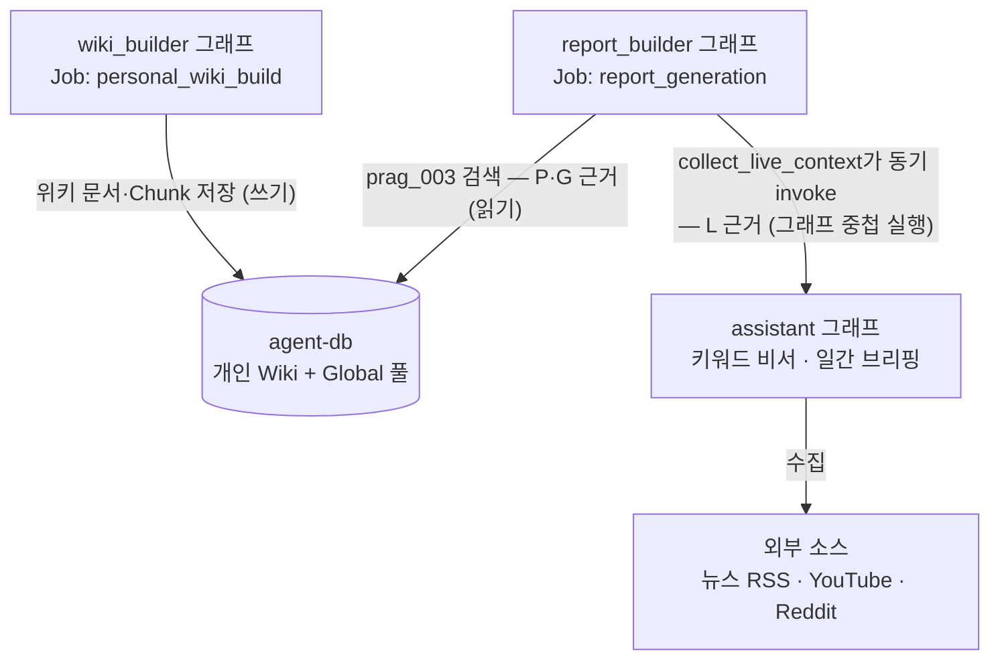
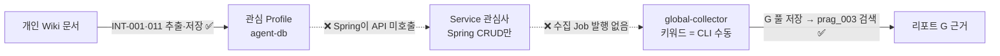

# 에이전트 구조 정리 — Wiki Builder · Assistant · Report Builder의 관계와 수집 루프

> 작성일: 2026-07-26 · 대상 독자: bambi-agent-api를 처음 보거나 일부만 아는 팀원
> 목적: 세 에이전트가 서로 어떤 관계인지, 왜 이렇게 나뉘었는지, 그리고 코드 조사로 확인된
> **"관심사 기반 수집 루프가 실제로는 끊겨 있다"**는 사실과 정리 방향을 한 문서로 공유한다.
> 모든 주장에는 확인한 코드 위치를 달았다. 심층 리뷰는 [langgraph-agents-review-2026-07-26.md](langgraph-agents-review-2026-07-26.md),
> 분해 실행안은 [assistant-split-proposal.md](assistant-split-proposal.md) 참조.

---

## 0. 세 줄 요약

1. 레포에는 LangGraph 그래프가 3개 있다 — **wiki_builder**(클리핑→개인 Wiki), **report_builder**(주제→출처 인용 리포트), **assistant**(키워드→일간 브리핑). report_builder는 wiki_builder의 산출물을 DB로 읽고(데이터 의존), assistant를 그래프 안에서 직접 호출한다(실행 의존).
2. 제품의 핵심 루프인 **"저장한 글에서 관심사를 뽑아 → 그 키워드로 최신 정보를 모아 → 리포트를 만든다"**는 부품이 전부 구현되어 있는데도 **접착부 3곳이 미연결**이라 한 번도 자동으로 돈 적이 없다. 수집 워커는 사람이 CLI로 키워드를 넣어야 돈다.
3. 그 공백을 메우려고 report_builder가 assistant를 통째로 호출하는 구조가 됐고, 이것이 수집 경로 이중화·개인화 이력 오염·실행 시간 잠식을 일으키고 있다. 해법은 그래프 병합이 아니라 **assistant가 겸직 중인 수집·선별 책임을 원래 소유자(워커·공용 라이브러리)에게 돌려주는 것**이다.

---

## 1. 등장인물: 그래프 3개

`/dev/graphs`에서 시각화되는 StateGraph 3개가 전부다 (`app/services/graph_diagrams.py:41-69`).

| 그래프 | 정의 위치 | 흐름 | 하는 일 |
|---|---|---|---|
| **wiki_builder** (Personal Wiki Build) | `agent/graph.py:49-186` | load_source → classify → plan → persist → finalize | 사용자가 저장한 클리핑 원문에서 entity/concept를 LLM으로 추출해 Obsidian 규격의 개인 Wiki 문서·관계·Chunk로 agent-db에 저장 |
| **report_builder** (Report Generation) | `agent/graph.py:213-378` | load_context → generate → persist | 주제(topic)를 받아 근거를 모으고, 출처 인용(`[P1]`,`[G1]`,`[L1]`)이 강제된 리포트를 생성·발행 |
| **assistant** (키워드 비서) | `agent/assistant/features/graph.py` | plan → select → (조건부) reformulate → write_report | 키워드로 뉴스 RSS·YouTube·Reddit을 수집·선별해 일간 브리핑 Markdown 생성. 자체 웹 UI(`/assistant/`) 보유 |

리포트의 근거 인용 체계 세 종류를 먼저 알아두면 이후가 쉽다:

- **P{n}** — 개인 Wiki 문서 (wiki_builder가 만든 것)
- **G{n}** — Global 수집 풀 문서 (`agent.global_source_documents` 캐시, 수집 워커가 채우는 소유권 없는 저장소. 0008에서 Wiki global namespace 방식 폐기)
- **L{n}** — 실시간(live) 외부 자료 (리포트 생성 순간에 assistant가 즉석 수집한 것. DB에 문서로 저장되어 있지 않아 url만 증빙)

## 2. 관계: 데이터 의존 하나, 실행 의존 하나

- **wiki_builder → report_builder: 코드 호출 없는 데이터 의존.** 서로 import하지 않는다. wiki_builder가 저장한 문서를 report_builder의 load_context가 `prag_003` 검색으로 읽을 뿐이다 (`agent/graph.py:221-227`).
- **report_builder → assistant: 그래프 안에서 그래프를 실행하는 중첩 관계.** load_context의 `collect_live_context`(`agent/report_builder/features/live_sources.py:107`)가 assistant의 진입점 `assist_daily_agent`를 동기 호출한다. 즉 **리포트 1건 = 그래프 2개 실행**이다. assistant의 수집·선별 결과(items)만 L 근거로 가져오고 브리핑 Markdown은 버리며, assistant가 실패하면 빈 목록으로 계속 진행한다(리포트는 P·G 근거만으로 생성).
- **wiki_builder ↔ assistant: 직접 관계 없음.** 공유하는 것은 LLM 공통 계층(`agent/llm`)뿐.

## 3. 왜 이렇게 나뉘었나 — 피벗의 역사

현재는 삭제된 과거 문서 `keyword-assistant.md`에 기록됐던 경위:

1. 원래는 **대형 리포트 생성기 명세**(기능 ID REPORT-\*)가 먼저 있었다. report_builder는 이 체계의 산물로, Service API와의 Job 계약·발행 파이프라인에 묶여 있다.
2. 이후 프로젝트가 **"키워드 → 수집·요약 비서"라는 새 방향**으로 재편됐고, assistant는 "기능 ID 체계에 속하지 않는 별도 제품 라인"으로 명시되어 자체 UI까지 갖게 됐다 (keyword-assistant.md 도입부).
3. 그런데 report_builder의 실시간 수집 기능(REPORT-005)이 당시 **패스스루**(개인 Wiki 결과를 그대로 흘려보내는 빈 구현)였다. 이를 고치면서 "로직을 복사하지 않고 assistant를 **호출**해서 쓰자"로 결정 — 두 파이프라인이 갈라지지 않게 하려는 의도였다 (keyword-assistant.md "Report Builder와의 연결" 절).

즉 처음부터 설계된 계층화가 아니라 **피벗 후 재사용의 결과**다. 분리 자체는 지금도 정당하다(브리핑과 리포트는 트리거·출력 계약·실행 모델이 다르다). 문제는 아래에서 보듯 **재사용의 이음새**다.

## 4. 발견 ① — 관심사 기반 수집 루프는 끊겨 있다

제품의 의도된 루프는 이것이다:

> 개인 Wiki에서 관심 키워드 추출 → 그 키워드로 수집 워커가 최신 정보를 모아 Global 풀에 저장 → report_builder가 풀을 검색해 리포트 생성

놀랍게도 **부품은 전부 존재한다**:

- **INT-001 관심 키워드 추출** — 구현됨. Wiki 문서의 제목·별칭·태그·요약에서 결정적으로 관심 후보를 뽑는다 (`domain/interests/features/extraction.py`). INT-011이 활성 Wiki 기준으로 재계산해 관심 Profile로 저장하고, `GET /users/{user_id}/interests`로 Service에 노출된다 (`app/routers/service/routes.py:236-248`).
- **global-collector 수집 워커** — 구현됨. GDELT·Naver·Google News RSS를 **키워드로 검색**해 Global 수집 캐시에 URL을 저장하고(`workers/features/global_source_collector.py`), 별도 Jina 워커(global-content)가 본문을 2단계로 채운다.
- **G 풀 검색** — 구현됨. report_builder의 `prag_003`이 개인 Wiki(`wiki_chunks`)와 Global 수집 캐시(`global_source_documents`)를 각각 검색해 Scope별 top-k로 합친다 (`infrastructure/persistence/features/generation_runtime.py`의 `load_report_context`).

그러나 **접착부 3곳이 전부 미연결**이다:

| # | 끊긴 곳 | 증거 |
|---|---|---|
| 1 | collector의 키워드는 **사람이 CLI로** 넣는다. 관심 Profile을 읽는 코드가 없고, 없으면 죽는다 | `workers/main.py:80-87` — `--keywords` 필수, 미지정 시 `RuntimeError`. Job 큐(claim/lease) 기반도 아닌 수동 배치 |
| 2 | Agent의 관심사 체인은 API **노출에서 끝난다**. Profile을 수집·리포트 topic으로 잇는 코드가 Agent 레포에 없다. 재계산(INT-011)도 라우트 호출 시에만 도는 on-demand | `int_011` 호출자 = `app/services/interests.py`(라우트 전용). wiki build 후 자동 재계산 훅 없음 |
| 3 | Spring(bambi-service-api)의 `InterestService`는 사용자 수동 등록 CRUD뿐. Agent의 interests API를 호출하지 않고, 관심사로 수집·생성을 스케줄하는 코드도 없다 (Agent 연동은 `MockAgentClient` 단계) | `bambi-service-api/.../interest/InterestService.java` — create/list/rename/delete만 |

결과: **관심사 기반 자동 수집은 한 번도 돈 적이 없다.** 지금 유일하게 자동으로 도는 키워드 수집은 report_builder가 assistant를 호출하는 인라인 수집인데, 그 키워드조차 관심사가 아니라 **리포트 Job의 topic**(요청자가 명시한 주제)이다.

## 5. 발견 ② — 수집 경로가 이중화되어 있고, 이음새에 부작용이 있다

위 공백을 assistant 인라인 호출로 메운 결과, 수집 경로가 두 개가 됐다:

| | 경로 A: global-collector 워커 (G) | 경로 B: assistant 인라인 (L) |
|---|---|---|
| 시점 | 배치(수동 실행) | 리포트 생성 요청 순간 |
| 소스 | GDELT · Naver · **Google News RSS** | **Google News RSS** · YouTube · Reddit |
| 저장 | G 풀에 문서로 저장 (version_id 있음) | 저장 안 함 — url만 증빙 (L citation은 FK가 NULL) |
| 선별 지능 | 없음 (원시 저장) | 있음 — 임베딩 필터·클러스터링·스코어링·7일 중복 제거 |

Google News RSS는 **양쪽에서 중복 수집**된다. 그리고 경로 B(중첩 호출)에는 리뷰에서 검증된 부작용 세 가지가 붙어 있다:

1. **개인화 이력 오염** — assistant는 (user_id, keyword) 키로 수집·중복제거 이력을 기록하므로, 리포트 생성이 이후 7일간 그 사용자의 일간 브리핑에서 같은 아이템을 제외시키고, 같은 주제로 리포트를 재생성하면 근거가 점점 고갈된다 (`agent/assistant/features/pipeline.py:233-237, 481-495`).
2. **실행 시간 잠식** — assistant의 재구성 루프(최대 3회 파이프라인 반복)까지 리포트 실행 시간에 포함되어 Worker lease(600초) 초과 → Job 이중 실행 위험을 키운다 (리뷰 P0 #4).
3. **계약 드리프트** — L citation은 DB 문서가 없는 특수 형태인데, Service 연동 계약서(agent-contract.md)에 반영되어 있지 않다 (리뷰 P0 #7).

## 6. 결론 — 방향: assistant를 쪼갠다 (그래프 병합이 아님)

진단을 한 문장으로 줄이면: **assistant가 "수집기 + 선별기 + 브리핑 제품 + 이력 저장"을 겸직하고 있어서, 리포트가 그중 둘만 필요한데 넷을 통째로 실행하는 구조가 모든 부작용의 뿌리다.**

따라서 방향은 책임의 재배치다 (상세 실행안: [assistant-split-proposal.md](assistant-split-proposal.md)):

- **수집 → `infrastructure/sources` + 수집 워커로 일원화.** YouTube·Reddit provider를 이식하고 RSS는 기존 col_001로 통일. 신선도는 워커 주기가 담당, 풀에 없는 콜드 키워드만 타임아웃 있는 동기 수집으로 보충.
- **선별 → 공용 라이브러리(`agent/selection` 신설).** 이력 기록 여부를 호출자가 결정(브리핑=기록, 리포트=미기록)해 이력 오염을 구조적으로 차단. 브리핑과 리포트가 같은 선별 함수를 공유.
- **assistant = 브리핑 제품만 잔류.** 재구성 루프·워터폴 보고서·주가 차트·UI.
- **report_builder = 풀 소비자로 단순화.** assistant 중첩 호출 제거 → L 근거 대부분이 version_id 있는 G로 바뀌어 계약도 단순해짐.
- **마지막으로 관심사 루프 연결** — collector를 job_type 워커로 승격하고, Service가 INT-001 관심 topic으로 수집·생성 Job을 발행 (§4의 끊긴 3링크. 스케줄 소유권은 Service이므로 팀 협의 필요).

단계는 5개로 나눴고 각각 독립 배포 가능하다. 특히 **Step 0**(assistant 호출에 `record_history=False`·`include_report=False` 옵션 추가)은 구조 변경 없이 반나절 규모로 이력 오염을 즉시 멈출 수 있다.

## 7. 자주 나올 질문

**Q. assistant와 report_builder를 그냥 합치면 안 되나?**
안 합치는 게 맞다. 트리거(키워드 브리핑 vs 주제 리포트 Job), 출력 계약(Markdown 브리핑 vs 인용 강제 JSON + 발행 트랜잭션), 실행 모델(connection 없는 동기 그래프 vs async DB 트랜잭션 노드)이 다르다. 겹치는 건 "수집·선별"뿐이고, 그건 둘 다에서 빼내 공용화하는 게 답이다.

**Q. 그럼 지금 리포트의 L(실시간) 근거는 어떻게 되나?**
대부분 "워커가 미리 수집해 둔 G 근거"로 대체된다. 풀에 없는 새 주제만 요청 시점 동기 수집(타임아웃 있는 예외 경로)으로 보충하므로 신선도는 유지된다.

**Q. 당장 뭐부터?**
① Step 0(이력 오염 차단, 반나절), ② 관심사 루프 연결의 소유권 협의(Service팀 — 스케줄·정책은 Service 소유가 CLAUDE.md 원칙), ③ agent-contract.md의 L citation 갱신(Service Gateway 구현 착수 전 필수).

**Q. 관심사 프로필 없이 report_builder가 wiki를 직접 읽으면 되지 않나?**
근거 검색은 이미 wiki를 직접 읽는다(prag_003 — 프로필 미사용). 프로필의 역할은 "찾기"가 아니라 "무엇을 위해 움직일지 고르기"(수집 키워드·카드 매칭·스케줄)이며, 그 자리에는 ① Service에 내보낼 수 있는 요약 형태(Spring은 agent-db를 직접 못 읽음), ② wiki가 담지 못하는 신호(좋아요·차단·최신성)의 반영 지점, ③ 안정된 키워드 셋과 감사 가능성이 필요하다. 프로필은 wiki와 경쟁하는 별도 소스가 아니라 **wiki를 읽어 계산한 materialized view**(INT-001의 입력이 wiki 문서)이고, 진짜 문제는 refresh가 수동이라는 것 — "wiki build 완료 → 자동 재계산 훅"이 해법이다. 전체 데이터 흐름·편집 정책·작업 분해는 [wiki-interest-subscription-design.md](../../wiki-interest-subscription-design.md) 참조.

## 참고 문서

- [langgraph-agents-review-2026-07-26.md](langgraph-agents-review-2026-07-26.md) — 두 그래프 심층 리뷰 (48개 개선점 코드 검증, P0/P1/P2)
- [assistant-split-proposal.md](assistant-split-proposal.md) — assistant 분해 실행안 (파일별 이동 매핑, Step 0~4, 결정 필요 사항 5가지)
- [wiki-interest-subscription-design.md](../../wiki-interest-subscription-design.md) — 지식 파이프라인 설계 (입력원 원칙 → Wiki → 관심사 프로필 → 구독, 편집 의미론, 작업 백로그 Track A~D)
- `keyword-assistant.md` — 현재는 삭제된 키워드 비서 명세와 피벗 경위
- `/dev/graphs` — 그래프 3개 실시간 시각화 (가드 테스트로 코드와 정합 보장)
