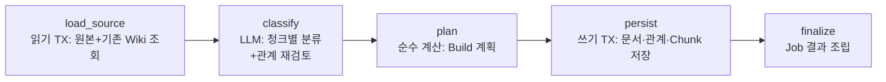
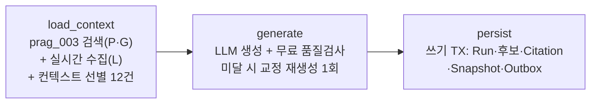

# LangGraph 에이전트 리뷰 — LLM Wiki Builder · Report Builder

> 작성일: 2026-07-26 · 대상: `agent/graph.py`의 StateGraph 2개(Personal Wiki Build, Report Generation)와 그 실행 경로 전체
> 분석 방법: 5개 영역(위키 빌더 구현 / 리포트 빌더 구현 / 실행·통합 / 테스트·벤치마크 / 명세 정합성) 병렬 심층 분석 후, 모든 개선점 주장을 실제 코드 대조로 재검증. **48개 개선점 중 45개 CONFIRMED, 3개 PARTIAL(정정 반영), 기각 0건.**
> 보존 메모: 이 리뷰가 언급하는 과거 벤치마크 경로와 결과 파일은 2026-08-10
> 저장소 정리에서 제거됐다. 문서는 당시 판단의 기록으로만 보존한다.

---

## 1. 한눈에 보기

| | LLM Wiki Builder | Report Builder |
|---|---|---|
| 그래프 | `load_source → classify → plan → persist → finalize` (5노드 선형) | `load_context → generate → persist` (3노드 선형) |
| 정의 위치 | `agent/graph.py:49-186` | `agent/graph.py:213-378` |
| LLM 호출 | classify 노드에서만 — 청크(8,000자)당 분류 1회 + 조건부 관계 재검토 1회 | generate 노드에서만 — 생성 1회 + 품질 미달 시 교정 재생성 최대 1회 |
| 트랜잭션 | 읽기(load_source) / 쓰기(persist) 분리, LLM은 트랜잭션 밖 `to_thread` | 동일 패턴 (조회/저장 트랜잭션 2개) |
| 진입점 | `run_personal_wiki_build` — dev API·Worker 공유 | `run_report_generation` — dev API·Worker 공유 |
| 기본 모델 | gpt-4.1-mini (temperature 0.3) | gpt-4.1-mini (temperature 0.3) |
| 벤치마크 | 데이터셋 12케이스(우수) — **실행 기록 0건** | 데이터셋 10케이스(변별력 부족) — 결과 1건(10/10) |

**종합 평가:** 트랜잭션 경계·멱등 영속화·환각 방어·단일 진입점 등 **기반 설계 품질은 높다**. 반면 (1) 예외 분류 설계 결함으로 LLM의 일시적 실패가 영구 실패로 굳고, (2) "출처 없는 답변 금지" 원칙의 마지막 관문이 비어 있으며, (3) 품질을 측정할 벤치마크가 절반은 미실행·절반은 무변별 상태라는 세 가지 축이 신뢰성의 구멍이다. LangGraph는 선형 파이프라인 이상으로 활용되지 않고 있다(조건부 엣지·checkpointer·병렬화 전무).

---

## 2. LLM Wiki Builder — 현재 상태

클리핑 원문(Markdown)을 받아 entity/concept를 추출하고, Obsidian 규격의 개인 지식 Wiki 문서·관계·Chunk·Build Snapshot으로 저장하는 그래프.

### 노드별 동작

- **load_source** (`graph.py:58-91`) — 읽기 트랜잭션 1개에서 RLS scope 설정(`set_personal_wiki_scope`) 후 원본 Version, 기존 entity/concept, 기존 관계를 조회. 원본 부재·원문 없음이면 ValueError.
- **classify** (`graph.py:93-106`) — LLM 경계가 동기(LangChain `invoke` + `time.sleep` 백오프)라 `to_thread`로 실행. 원문을 8,000자 청크로 나눠 청크마다 분류 1회 호출하고, 노드 2개 이상인데 검증된 관계가 0이면 관계 재검토를 1회 추가 호출한다(`classification.py:462-503`). 호출당 timeout 120초, 일시 오류 3회 지수 백오프(`agent/llm/features/client.py:16-18, 92-101`).
- **plan** (`graph.py:108-124`) — LLM 없음. 분류 결과+기존 Wiki 상태를 append-only 원칙으로 병합해 문서·관계·아티팩트 계획으로 변환(`planning.py:426-534`). 날짜·경로·해시는 LLM 값이 아니라 시스템이 직접 주입.
- **persist** (`graph.py:126-136`) — 쓰기 트랜잭션 1개. namespace 단위 advisory xact lock으로 동시 빌드 직렬화, `built_by_job_id` FOR UPDATE로 멱등성 확보(`infrastructure/persistence/features/personal_wiki.py:865-935`).
- **finalize** (`graph.py:138-172`) — index/source/log 아티팩트를 포함한 Job 결과 payload 조립(DB 저장 아님 — vault 구조 문서와 일치).

### 환각 방어 (잘 갖춰진 부분)

- mentions는 **원문 exact substring만 통과** (`classification.py:92-97`)
- 관계는 ref 존재·자기참조·유형 정합·원문 evidence 존재를 전부 검증 (`relations.py:61-142`)
- subtype 화이트리스트 강제, 프롬프트 인젝션 방어 문구 포함
- Embedding 생성은 2026-07-20 결정으로 실행 경로에서 제외(활용처인 Vector 검색 미도입) — 코드·mvp-scope 문서 모두 반영됨. 단 Worker docstring만 갱신 누락.

---

## 3. Report Builder — 현재 상태

주제(topic)를 받아 개인 Wiki 검색 + 실시간 외부 수집(뉴스 RSS·YouTube·Reddit)을 합쳐, 출처 인용이 강제된 리포트 콘텐츠를 생성·발행하는 그래프.

### 노드별 동작

- **load_context** (`graph.py:219-281`) — ① `prag_003` "Hybrid" 검색: 실제로는 **pg_trgm + ts_rank 키워드 검색만** 수행(Vector 없음), 개인+global namespace에서 스코프별 top 5. 결과 0건이면 **최근 문서를 score 0으로 폴백**. ② `collect_live_context`: 키워드 비서(`assist_daily_agent`) 전체를 재실행해 실시간 자료를 `L{n}` 참조로 변환 — 수집 실패는 빈 목록 폴백(생성은 계속). ③ `select_generation_context`: P·G를 앞에, L을 뒤에 배치해 최대 12건 선별.
- **generate** (`graph.py:283-328`) — `generate_report_content_with_quality`(`generation.py:114-172`): 컨텍스트를 16,000자까지 그리디 포함해 생성 → JSON 파싱 + **허용 외 Citation 참조 차단** → 무료 품질 검사(인용 0개 / 300자 미만 / 인용률 30% 미만) → 재생성 대상이면 교정 지시를 붙여 최대 1회 재생성. 깨진 JSON도 1회 재생성 대상.
- **persist** (`graph.py:330-368`) — `prag_007`이 citation ⊆ contexts 재검증 후 Run·후보('ready')·Citation·publish_snapshot('ready')·CONTENT_READY Outbox를 **한 트랜잭션**으로 저장.

### FeatureRequest + lambda 간접화의 실태

그래프 안의 기능 ID 호출 10개 중 **실질 구현은 3개뿐**(report_005 수집, report_006 선별, report_008 생성). 나머지 7개(report_004/009/011/012/018/020/021)는 직전 값을 그대로 반환하는 **항등 패스스루**다. `execute_feature_implementation`은 로깅·계측 없이 lambda를 호출할 뿐이어서, 기능 ID로 코드를 추적하면 구현 위치를 찾을 수 없다.

---

## 4. 실행 구조 (공통)

- **진입점 단일화가 실제로 지켜진다.** dev API(`app/services/agent_workflows.py`)와 운영 Worker(`workers/features/*.py`)가 `run_personal_wiki_build`/`run_report_generation`을 그대로 공유 — 개발에서 검증한 그래프가 운영에서 다르게 돌 위험이 구조적으로 차단됨.
- **Job 생명주기**는 DB가 관리: SKIP LOCKED batch claim → lease(기본 600초) → 완료/실패 시 소유권 검증 → 실패 시 SQL 내 exponential backoff로 재큐잉(`jobs.py:449-523`). 시도 이력은 `agent_job_attempts`에 기록.
- **그래프는 요청마다 rebuild+compile** — 노드 클로저가 connection을 캡처하기 때문. 컴파일 비용 자체는 미미하지만 checkpointer 부착·컴파일 캐시를 막는 구조적 제약이다(비서 그래프는 1회 컴파일 캐시 사용 — 내부 비일관).
- **checkpointer 없음** — 재시도는 항상 첫 노드부터 전체 재실행(성공한 LLM 호출 비용 중복 지불).
- **관측성**: LangSmith/OTel 0건. 토큰 측정 함수(`complete_with_usage`)는 있으나 운영 경로에서 미사용. Report 그래프만 generate 노드 지연을 기록하고 Wiki 그래프는 노드별 지연 기록이 전혀 없다.
- **/dev/graphs 레지스트리**는 실제 StateGraph 3개와 정합하며 가드 테스트가 등록 누락을 CI에서 차단.

---

## 5. 잘 되어 있는 점 (유지할 것)

1. **트랜잭션 경계 설계가 정석** — DB 노드만 짧은 트랜잭션 소유, 수십 초짜리 LLM 호출 동안 트랜잭션·락을 잡지 않음.
2. **환각 방어 다층화** — verbatim 인용 검증, citation 화이트리스트 2중 강제(파싱 시 + 저장 직전), 시스템 값 직접 주입.
3. **멱등·동시성 제어** — advisory lock, FOR UPDATE 재실행 감지, content_hash 기반 버전 관리, outbox dedup key.
4. **품질 루프의 비용 의식적 설계** — LLM 없는 무료 판정, "재생성으로 나아질 수 있는 문제만" 재생성, 근거 부족 시 헛재생성 차단.
5. **실패 격리 3겹(Worker)** — Job 실패 → batch 계속, 실패 기록 실패 → lease_lost 강등, batch 실패 → 상주 루프 계속.
6. **결정적 단위 테스트** — LLM·DB 없이 그래프 노드 순서·결과 조립·트랜잭션 수를 검증. 파싱 실패 경로도 mock으로 촘촘히 커버.
7. **wiki 벤치 데이터셋 품질** — 프롬프트 인젝션, 8,000자+ 긴 입력, 별칭 억제, verbatim 인용, 한영 혼용 등 경계 케이스를 실질적으로 포함.

---

## 6. 개선점 — 우선순위별

심각도와 검증 결과(재검증 시 정정된 내용 반영)를 기준으로 P0/P1/P2로 재구성했다.

### P0 — 신뢰성 구멍 (지금 고칠 것)

| # | 문제 | 근거 | 제안 |
|---|---|---|---|
| 1 | **LLM 출력 형식 오류가 '입력 오류(재시도 불가)'로 오분류** — 파싱 실패 ValueError를 batch_runner가 `*_INPUT_INVALID`로 기록해 Job 영구 실패. 두 그래프 공통. | `classification.py:230-233`, `generation.py:152-155`, `batch_runner.py:42-47` | LLM 형식 오류 전용 예외(재시도 가능) 분리, 또는 retryable 판정을 예외 타입 대신 명시 플래그로 |
| 2 | **인용 0개 콘텐츠도 'ready'로 발행** — 품질 루프가 재생성 상한 후 미달 결과를 그대로 반환하고, persist는 무조건 'ready' 저장. "출처 없는 답변 금지" 불변식의 마지막 관문 부재. | `generation.py:167-172`, `generation_runtime.py:471,567` | 최종 NO_CITATIONS이면 'draft'/'blocked' 저장 또는 재시도 실패 처리. 스텁인 REPORT-019가 이 게이트의 자리 |
| 3 | **dev API와 Worker의 retryable 판정 규칙이 정반대** — Worker는 ValueError 외 전부 재시도, dev API는 Jina/Timeout 외 전부 영구 실패. 같은 예외가 경로 따라 다르게 기록. | `batch_runner.py:42` vs `agent_workflows.py:211` | 예외→(error_code, retryable) 매핑을 shared 단일 함수로 추출해 양쪽 공유 |
| 4 | **lease(600초) heartbeat 부재로 Job 이중 실행 가능** — LLM 1건 최악 ~363초 × 다중 호출로 lease 초과 시 다른 Worker가 재점유, LLM 비용 이중 지불(데이터는 멱등 덕에 안전). WC-003은 NotImplementedError. | `jobs.py:130-135`, `heartbeat.py:9-14`, `client.py:16-18` | 노드 경계에서 lease 연장(heartbeat) 구현, 또는 LLM 노드 진입 전 잔여 lease 확인 |
| 5 | **wiki_builder 벤치마크 실행 기록 0건** — 우수한 12케이스 데이터셋·실행기가 있는데 `results/`가 없고 git 이력에도 없음. 프롬프트·관계 로직을 바꾼 커밋(1ead6e3) 이후에도 미실행 → 분류 품질이 측정된 적 없음(규칙 8 위반). | `bench/wiki_builder/` (results/ 부재) | 비용 승인 후 1회 실행해 기준선 커밋, 이후 프롬프트 변경 시 재실행을 PR 체크리스트화 |
| 6 | **report 벤치 데이터셋 변별력 없음** — 10케이스 전부 'P1+G1 한 문장씩' 동일 구조. L 참조·빈 컨텍스트·거절 케이스 부재가 실제 Citation 버그를 놓친 원인이었음을 결과 파일이 자인. | `bench/report_generation/dataset.jsonl`, `results/2026-07-23*.md:44-49` | 승인 후 L 참조·다수 컨텍스트·인용 불가(거절) 케이스 추가 |
| 7 | **agent-contract.md가 L citation 체계 미반영** — 실코드는 P/G/L 3종, L은 document_version_id NULL + url 필수인데, 계약 문서는 P/G 2종에 옛 가정("P만 url=null"). 이대로 Spring Gateway를 구현하면 어긋남. | `docs/agent-contract.md:117-120` vs `live_sources.py:54-80`, `generation_runtime.py:362-375` | 계약 문서 §3.1 갱신 (L 추가, NULL FK 규칙, snapshot citation의 reference 필드) |

### P1 — 품질·정확성 개선

| # | 문제 | 요약 |
|---|---|---|
| 8 | 품질 루프 인용률 분모 불일치 | 16,000자 절단으로 프롬프트에 못 들어간 문서까지 분모에 포함 → 절대 통과 불가능한 헛재생성 발생 가능. 분모를 `included_references` 수로 교체 (`generation.py:93-97,163`) |
| 9 | 실시간 근거(L)가 체계적으로 밀려남 | P·G 우선 배치 + 앞에서부터 절단이라 L이 먼저 탈락 — "최신 자료로 만든다"는 도입 목적과 상충. 풀별 쿼터 또는 라운드로빈 (`live_sources.py:150-161`) |
| 10 | 비서 개인화 이력 오염 | 리포트 생성이 비서의 수집·중복제거 이력에 기록됨 → 이후 7일 브리핑에서 같은 아이템 제외, 리포트 재생성 시 근거 고갈. read-only 모드 필요 (`live_sources.py:107`, `pipeline.py:233-237,481-495`) |
| 11 | prag_003 폴백이 주제 무관 문서 주입 | 검색 0건 시 최근 문서를 score 0으로 "근거"에 넣음 → 무관 인용 또는 헛재생성 유발. 폴백 문서 구분 표시 또는 제거 (`generation_runtime.py:302-336`) |
| 12 | dedup된 문서를 향한 관계가 조용히 유실 | content_hash dedup 시 plan 키≠저장 키가 되어 관계 저장이 무언 skip — 경고에도 안 잡힘. 키 매핑 치환 + dropped 카운트 노출 (`personal_wiki.py:680-688,894-902`) |
| 13 | checkpointer 부재 | persist 실패 시 성공한 LLM 단계까지 전체 재실행. 중간 산출물 저장 또는 PostgresSaver 검토 (`graph.py:186,378`) |
| 14 | 완전 순차 처리 | 검색(DB)과 실시간 수집(네트워크) 직렬, 뉴스→YouTube→Reddit 직렬, 청크별 LLM 직렬 — E2E 수십 초~수 분. asyncio.gather 병렬화 (`graph.py:221-255`, `pipeline.py:165-177`) |
| 15 | structured output 미사용 | 일반 텍스트 completion + json.loads 의존, 파싱 재시도 없음. json mode 도입 후 벤치 재실행 (분류 경로만 Job 실패로 이어짐 — 관계 재검토는 경고 강등이 이미 있음) |
| 16 | 관측성 부재 | LangSmith 0건, 토큰 실측 미연결(측정 함수는 있음), Wiki 그래프 노드별 지연 무기록. 구조화 로그 → 선택적 LangSmith 순으로 |
| 17 | 벤치가 실경로와 다름 | report 벤치는 품질 루프를 우회한 내부 함수 호출 + temperature 불일치(wiki: 벤치 0 vs 운영 0.3). 실경로 함수·운영 파라미터로 정렬 |
| 18 | 그래프 오류 경로 테스트 부재 | test_graph.py는 성공 경로 2개뿐 — 원본 부재·빈 컨텍스트 시 예외 전파와 후속 노드 미실행 검증 추가 |

### P2 — 구조 정리·문서 동기화

- **FeatureRequest lambda 간접화 정리** — 항등 패스스루 7개를 제거하거나 실구현을 기능 함수로 이동, 최소한 facade docstring에 실구현 위치 명시 (REPORT-014/016도 스텁인데 구현은 quality.py·generation.py에 존재 — 명세 체크리스트 미기재)
- **connection 클로저 → configurable 주입** — 그래프 1회 컴파일 캐시 가능해지고 /dev/graphs None 스텁 특례 제거, checkpointer 도입 경로 확보
- **중복 구현 제거** — `build_incremental_wiki`(orchestration.py)는 그래프와 동일 로직의 별도 구현으로 호출처가 테스트뿐 — drift 위험
- **죽은 스캐폴드 정리** — `agent/nodes/*`, `agent/state.py`의 `AgentState`는 미참조 스텁인데 비서의 동명 클래스와 혼동 유발
- **State 타입 강화** — 두 State의 필드가 전부 `NotRequired[object]` — 이미 존재하는 구체 타입 지정
- **청크 분할 개선** — docstring("문단 경계")과 달리 라인 기반 하드 컷이라 경계 걸친 인용 유실 — 문장 경계 분할 + overlap
- **문서 정정** — Worker docstring의 Embedding 잔재, keyword-assistant.md '남은 정리' 절의 자기모순(report_builder를 삭제 후보로 기술), graph_diagrams docstring의 존재하지 않는 테스트 파일명, REPORT-004가 실제로는 global 풀까지 검색하는 경계 불일치
- **벤치 인프라 정렬** — report run.py에 결과 자동 기록·토큰 실측·프롬프트 버전(wiki run.py 패턴 이식), wiki run.py에 비용 확인 게이트(report 패턴 이식), 회귀 자동 비교
- **wc_013 docstring 정정** — '동시성 제어'가 실제로는 순차 for 루프 (현재 batch 1이라 실해 없음)

> 재검증에서 정정된 것: "비서 재사용 시 일간 보고서 LLM 호출이 낭비된다"는 주장은 **과장**으로 판정 — daily 모드는 LLM 없이 Markdown 조립이며, LLM 1회 낭비는 weekly 폴백 경로뿐(심각도 low로 하향). 클러스터 요약 LLM 호출은 리포트가 실제로 소비하므로 낭비가 아님.

---

## 7. 권장 실행 순서

1. **예외 분류 재설계** (#1·#3 동시 해결) — shared 예외→retryable 매핑 함수 하나로 두 진입점 통일. 반나절 규모, 효과 즉시.
2. **발행 게이트** (#2) — persist 직전 NO_CITATIONS 검사 추가. 서비스 신뢰의 핵심 불변식.
3. **벤치 기준선 확보** (#5·#6) — wiki 벤치 1회 실행 + report 데이터셋 보강. 이후 모든 프롬프트 개선의 전제 조건.
4. **계약 문서 갱신** (#7) — Service팀이 Gateway 구현에 착수하기 전에.
5. **heartbeat 또는 lease 동적 산정** (#4) — 긴 문서 유입이 늘기 전에.
6. P1 항목은 "품질 루프 정합(#8·#9·#11)" → "병렬화(#14)" → "관측성(#16)" 순 권장.
