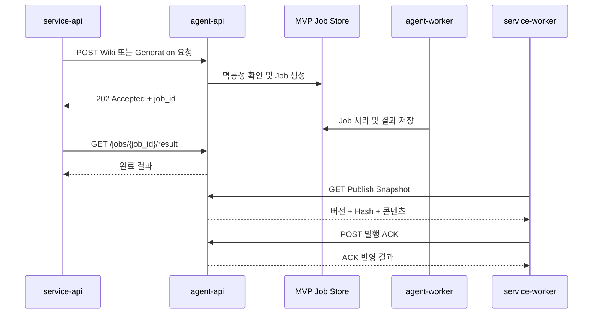

# FastAPI MVP API 설계

이 문서는 `agent-api-mvp-scope.md`에서 Agent API가 HTTP로 제공해야 하는 Service API 및 Service Worker 연동 범위를 구체화합니다.

## 설계 원칙

- 내부 API Prefix는 기본 `/internal/v1`이며 `API_PREFIX` 환경변수로 변경할 수 있습니다.
- 내부 인증은 MVP 제외 범위이므로 적용하지 않습니다. 인증 추가 전까지 외부 네트워크에 노출하지 않습니다.
- Request ID와 Trace ID는 각각 `X-Request-ID`, `X-Trace-ID` 헤더로 전달하며, 누락되거나 형식이 잘못되면 Agent API가 생성합니다.
- 비동기 Wiki 및 생성 요청은 `202 Accepted`와 `job_id`를 반환합니다.
- 사용자 컨텍스트는 단조 증가하는 `context_version`으로 오래된 데이터 덮어쓰기를 방지합니다.
- 웹 클리핑, URL, 위키마킹과 콘텐츠 생성은 요청별 멱등성 키로 중복 Job 생성을 방지합니다.
- 모든 오류는 `code`, `message`, `request_id`, `retryable`, `details` 필드를 가진 공통 구조로 반환합니다.

## 시스템 API

| Method | Path | 기능 ID | 설명 |
|---|---|---|---|
| `GET` | `/system/live` | `SYS-009` | 프로세스 생존 상태를 반환합니다. |
| `GET` | `/system/ready` | `SYS-010` | 컨테이너와 MVP 서비스 준비 상태를 반환합니다. |
| `GET` | `/system/version` | `SYS-011` | 앱 이름, 버전과 실행 환경을 반환합니다. |

## Service API 연동

| Method | Path | 기능 ID | 성공 상태 | 설명 |
|---|---|---|---:|---|
| `PUT` | `/internal/v1/users/{user_id}/context` | `SVC-001` | `200` | 사용자 플랜, 언어, 개인화 및 차단 설정을 반영합니다. |
| `POST` | `/internal/v1/users/{user_id}/wiki-sources/clippings` | `SVC-002` | `202` | 웹 클리핑 Personal Wiki Builder Job을 등록합니다. |
| `POST` | `/internal/v1/users/{user_id}/wiki-sources/urls` | `SVC-003` | `202` | URL Personal Wiki Builder Job을 등록합니다. |
| `POST` | `/internal/v1/users/{user_id}/wiki-sources/content-marks` | `SVC-004` | `202` | 생성 콘텐츠 위키마킹 Job을 등록합니다. |
| `POST` | `/internal/v1/users/{user_id}/generations` | `SVC-008` | `202` | 밤비 콘텐츠 생성 Job을 등록합니다. |
| `GET` | `/internal/v1/jobs/{job_id}` | `SVC-013` | `200` | Job 상태와 진행률을 조회합니다. |
| `GET` | `/internal/v1/jobs/{job_id}/result` | `SVC-014` | `200` | 완료된 Job 결과를 조회합니다. 미완료 시 `409`를 반환합니다. |

## Service Worker 연동

| Method | Path | 기능 ID | 성공 상태 | 설명 |
|---|---|---|---:|---|
| `GET` | `/internal/v1/publish-snapshots/{content_id}` | `SW-004` | `200` | service-db 저장에 사용할 최신 Snapshot을 반환합니다. |
| `POST` | `/internal/v1/publish-snapshots/{content_id}/ack` | `SW-009` | `200` | Service Worker가 반영한 버전과 Hash를 검증하고 ACK를 기록합니다. |

`SW-001 Content Ready 이벤트 수신`과 `SW-007 service-db 콘텐츠 Upsert`는 Service Worker 및 Event Bus 책임이므로 Agent API HTTP 엔드포인트로 제공하지 않습니다.

## 요청 처리 흐름

## 오류 코드

| Code | HTTP | 설명 |
|---|---:|---|
| `REQUEST_VALIDATION_ERROR` | `422` | 요청 Path 또는 Body 검증에 실패했습니다. |
| `STALE_CONTEXT_VERSION` | `409` | 최신 버전보다 오래된 사용자 컨텍스트입니다. |
| `JOB_NOT_FOUND` | `404` | Agent Job이 존재하지 않습니다. |
| `JOB_RESULT_NOT_READY` | `409` | Job 결과가 아직 준비되지 않았습니다. |
| `PUBLISH_SNAPSHOT_NOT_FOUND` | `404` | 발행 Snapshot이 존재하지 않습니다. |
| `PUBLISH_SNAPSHOT_MISMATCH` | `409` | ACK 버전 또는 Hash가 Snapshot과 다릅니다. |
| `SERVICE_NOT_READY` | `503` | 애플리케이션 컴포넌트가 준비되지 않았습니다. |
| `INTERNAL_SERVER_ERROR` | `500` | 예상하지 못한 내부 오류가 발생했습니다. |

## MVP 저장소 제한

현재 `AgentApiMvpService`는 API 계약과 상태 전이를 먼저 검증하기 위한 메모리 저장소입니다. 프로세스 재시작 시 컨텍스트, Job, Snapshot과 ACK가 사라지며 다중 인스턴스 간 상태를 공유하지 않습니다. Agent DB와 Queue Adapter가 구현되면 동일한 서비스 경계를 유지한 채 영속 구현으로 교체해야 합니다.
