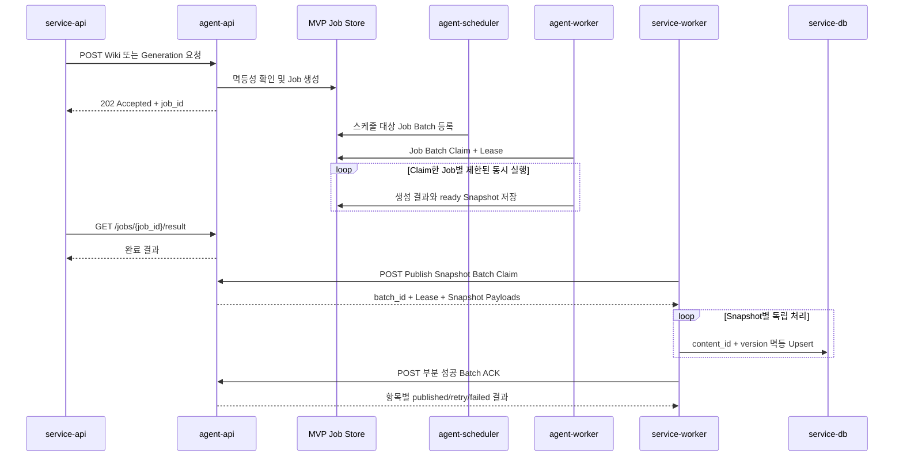

# FastAPI MVP API 설계

이 문서는 `agent-api-mvp-scope.md`에서 Agent API가 HTTP로 제공해야 하는 Service API 및 Service Worker 연동 범위를 구체화합니다.

## 설계 원칙

- 내부 API Prefix는 기본 `/internal/v1`이며 `API_PREFIX` 환경변수로 변경할 수 있습니다.
- 내부 인증은 MVP 제외 범위이므로 적용하지 않습니다. 인증 추가 전까지 외부 네트워크에 노출하지 않습니다.
- Request ID와 Trace ID는 각각 `X-Request-ID`, `X-Trace-ID` 헤더로 전달하며, 누락되거나 형식이 잘못되면 Agent API가 생성합니다.
- 비동기 Wiki 및 생성 요청은 `202 Accepted`와 `job_id`를 반환합니다.
- 사용자 컨텍스트는 단조 증가하는 `context_version`으로 오래된 데이터 덮어쓰기를 방지합니다.
- 웹 클리핑, URL, 위키마킹과 콘텐츠 생성은 요청별 멱등성 키로 중복 Job 생성을 방지합니다.
- Agent Worker는 Job을 Batch로 Claim하되 각 Job을 독립 실행하며, Claim 크기와 실제 LLM 호출 동시성을 분리합니다.
- Service Worker는 준비된 Publish Snapshot을 Lease가 있는 Batch로 Claim하고 항목별 반영 결과를 부분 성공 ACK로 전달합니다.
- 모든 오류는 `code`, `message`, `request_id`, `retryable`, `details` 필드를 가진 공통 구조로 반환합니다.

## 시스템 API

| Method | Path | 기능 ID | 설명 |
|---|---|---|---|
| `GET` | `/system/live` | `SYS-009` | 프로세스 생존 상태를 반환합니다. |
| `GET` | `/system/ready` | `SYS-010` | 컨테이너와 MVP 서비스 준비 상태를 반환합니다. |
| `GET` | `/system/version` | `SYS-011` | 앱 이름, 버전과 실행 환경을 반환합니다. |

## Service API 연동

| Method | Path | 기능 ID | 성공 상태 | 설명 |
|---|---|---|---:|---|
| `PUT` | `/internal/v1/users/{user_id}/context` | `SVC-001` | `200` | 사용자 플랜, 언어, 개인화 및 차단 설정을 반영합니다. |
| `POST` | `/internal/v1/users/{user_id}/wiki-sources/clippings` | `SVC-002` | `202` | 웹 클리핑 Personal Wiki Builder Job을 등록합니다. |
| `POST` | `/internal/v1/users/{user_id}/wiki-sources/urls` | `SVC-003` | `202` | URL Personal Wiki Builder Job을 등록합니다. |
| `POST` | `/internal/v1/users/{user_id}/wiki-sources/content-marks` | `SVC-004` | `202` | 생성 콘텐츠 위키마킹 Job을 등록합니다. |
| `POST` | `/internal/v1/users/{user_id}/generations` | `SVC-008` | `202` | 밤비 콘텐츠 생성 Job을 등록합니다. |
| `GET` | `/internal/v1/jobs/{job_id}` | `SVC-013` | `200` | Job 상태와 진행률을 조회합니다. |
| `GET` | `/internal/v1/jobs/{job_id}/result` | `SVC-014` | `200` | 완료된 Job 결과를 조회합니다. 미완료 시 `409`를 반환합니다. |

## Service Worker 연동

| Method | Path | 기능 ID | 성공 상태 | 설명 |
|---|---|---|---:|---|
| `GET` | `/internal/v1/publish-snapshots/{content_id}` | `SW-004` | `200` | service-db 저장에 사용할 최신 Snapshot을 반환합니다. |
| `POST` | `/internal/v1/publish-snapshot-batches/claim` | `SW-004` | `200` | 준비된 Snapshot을 Lease와 함께 Batch Claim하고 전체 Payload를 반환합니다. |
| `POST` | `/internal/v1/publish-snapshots/{content_id}/ack` | `SW-009` | `200` | Service Worker가 반영한 버전과 Hash를 검증하고 ACK를 기록합니다. |
| `POST` | `/internal/v1/publish-snapshot-batches/{batch_id}/ack` | `SW-009` | `200` | Batch의 항목별 성공·실패·재시도 결과를 부분 성공 ACK로 기록합니다. |

`SW-001 Content Ready 이벤트 수신`과 `SW-007 service-db 콘텐츠 Upsert`는 Service Worker 및 Event Bus 책임이므로 Agent API HTTP 엔드포인트로 제공하지 않습니다.

Batch 경로는 각각 `SW-004 Publish Snapshot 조회`와 `SW-009 발행 완료 ACK`의 HTTP 변형입니다. 기능 구현과 facade는 기존 기능 ID를 재사용하고 OpenAPI Operation ID만 단건과 Batch 경로에서 고유하게 정의합니다.

### Publish Snapshot Batch Claim

`POST /internal/v1/publish-snapshot-batches/claim`은 조회와 동시에 처리 소유권을 변경하므로 `GET`이 아니라 `POST`를 사용합니다.

요청 예시:

```json
{
  "worker_id": "service-worker-01",
  "limit": 50,
  "lease_seconds": 120
}
```

| 필드 | 필수 | 제약 | 설명 |
|---|---|---|---|
| `worker_id` | O | 1~128자 | Batch를 처리할 Service Worker Instance 식별자입니다. |
| `limit` | X | 기본 50, 1~100 | 요청하는 최대 Snapshot 수입니다. Payload 상한에 따라 더 적게 반환할 수 있습니다. |
| `lease_seconds` | X | 기본 120, 30~600 | 다른 Worker가 다시 Claim할 수 없도록 보장할 시간입니다. |

응답 예시:

```json
{
  "batch_id": "8de3ad52-9700-4e45-a8f6-f633e93847e0",
  "worker_id": "service-worker-01",
  "lease_expires_at": "2026-07-13T06:02:00Z",
  "items": [
    {
      "content_id": "content-001",
      "user_id": "user-001",
      "version": 1,
      "snapshot_hash": "opaque-hash",
      "title": "생성 콘텐츠 제목",
      "summary": "피드용 요약",
      "body": "생성 콘텐츠 본문",
      "citations": [],
      "created_at": "2026-07-13T06:00:00Z"
    }
  ]
}
```

- Agent API는 `ready`이면서 `next_attempt_at`이 없거나 현재 시각 이전인 Snapshot과, `claimed`이지만 Lease가 만료된 Snapshot을 `created_at, id` 순으로 선택합니다.
- 선택과 Claim 갱신은 하나의 짧은 DB Transaction에서 `FOR UPDATE SKIP LOCKED`로 처리합니다.
- Claim된 항목은 같은 `batch_id`, `claimed_by`, `lease_expires_at`을 갖고 `claimed` 상태가 됩니다.
- 응답에는 Service Worker가 추가 단건 조회 없이 service-db에 Upsert할 수 있도록 전체 Snapshot Payload를 포함합니다.
- 처리 가능한 항목이 없으면 `items=[]`를 반환하고 `batch_id`, `lease_expires_at`은 `null`로 반환합니다.
- 전체 응답 크기 상한을 넘을 때 Agent API는 `limit`보다 적은 항목을 반환할 수 있으며 Snapshot 하나가 상한을 넘으면 해당 본문은 Object Storage 참조 계약으로 분리해야 합니다.

### Publish Snapshot Batch ACK

Service Worker는 각 Snapshot을 `content_id + version`으로 service-db에 멱등 Upsert하고 Commit이 끝난 뒤 Batch ACK를 전송합니다. 전체 Batch를 하나의 service-db Transaction으로 묶지 않습니다.

요청 예시:

```json
{
  "worker_id": "service-worker-01",
  "items": [
    {
      "content_id": "content-001",
      "version": 1,
      "snapshot_hash": "opaque-hash",
      "status": "published"
    },
    {
      "content_id": "content-002",
      "version": 1,
      "snapshot_hash": "opaque-hash-2",
      "status": "failed",
      "retryable": true,
      "failure_reason": "service-db timeout"
    }
  ]
}
```

| 필드 | 필수 | 제약 | 설명 |
|---|---|---|---|
| `worker_id` | O | Claim 요청과 동일 | 다른 Worker가 획득한 Batch의 ACK를 차단합니다. |
| `items` | O | 1~100개 | 실제 처리가 끝난 항목만 전달합니다. 누락 항목은 Lease 만료 후 재처리됩니다. |
| `content_id` | O | 1~128자 | 발행 콘텐츠 식별자입니다. |
| `version` | O | 1 이상 | service-db에 반영한 Snapshot 버전입니다. |
| `snapshot_hash` | O | 비어 있지 않음 | Claim 응답과 동일한 무결성 Hash입니다. |
| `status` | O | `published`, `failed` | 항목별 반영 결과입니다. |
| `retryable` | 실패 시 O | Boolean | 실패 항목을 Backoff 후 다시 Ready로 전환할지 결정합니다. |
| `failure_reason` | 실패 시 O | 최대 2,000자 | Secret과 원문 Payload를 제외한 안전한 실패 사유입니다. |

응답 예시:

```json
{
  "batch_id": "8de3ad52-9700-4e45-a8f6-f633e93847e0",
  "published_count": 1,
  "retry_scheduled_count": 1,
  "failed_count": 0,
  "results": [
    {"content_id": "content-001", "version": 1, "result": "published"},
    {"content_id": "content-002", "version": 1, "result": "retry_scheduled"}
  ],
  "acknowledged_at": "2026-07-13T06:01:00Z"
}
```

- `published` 항목은 Snapshot을 `published`로 전환하고 발행 시도 이력을 추가합니다.
- 재시도 가능한 실패는 Exponential Backoff가 반영된 `next_attempt_at`을 기록하고 `ready`로 되돌립니다.
- 재시도 불가능하거나 최대 시도를 초과한 실패는 `failed`로 전환합니다.
- Batch 소유권과 Lease는 요청 전체에 대해 검증하고, 각 항목의 Version과 Hash는 독립적으로 검증해 부분 성공 결과에 반영합니다.
- 같은 `batch_id`와 항목 결과로 ACK를 다시 보내면 이전 처리 결과를 반환하며 발행 이력을 중복 생성하지 않습니다.
- ACK에 포함하지 않은 항목은 Lease 만료 전까지 `claimed`를 유지하고 만료 후 다른 Worker가 Claim할 수 있습니다.

## 요청 처리 흐름



## 오류 코드

| Code | HTTP | 설명 |
|---|---:|---|
| `REQUEST_VALIDATION_ERROR` | `422` | 요청 Path 또는 Body 검증에 실패했습니다. |
| `STALE_CONTEXT_VERSION` | `409` | 최신 버전보다 오래된 사용자 컨텍스트입니다. |
| `JOB_NOT_FOUND` | `404` | Agent Job이 존재하지 않습니다. |
| `JOB_RESULT_NOT_READY` | `409` | Job 결과가 아직 준비되지 않았습니다. |
| `PUBLISH_SNAPSHOT_NOT_FOUND` | `404` | 발행 Snapshot이 존재하지 않습니다. |
| `PUBLISH_SNAPSHOT_MISMATCH` | `409` | ACK 버전 또는 Hash가 Snapshot과 다릅니다. |
| `PUBLISH_BATCH_NOT_FOUND` | `404` | Batch Claim 식별자가 존재하지 않습니다. |
| `PUBLISH_BATCH_OWNERSHIP_MISMATCH` | `409` | ACK Worker가 Batch를 Claim한 Worker와 다릅니다. |
| `PUBLISH_BATCH_LEASE_EXPIRED` | `409` | Batch Lease가 만료되어 ACK를 반영할 수 없습니다. |
| `SERVICE_NOT_READY` | `503` | 애플리케이션 컴포넌트가 준비되지 않았습니다. |
| `INTERNAL_SERVER_ERROR` | `500` | 예상하지 못한 내부 오류가 발생했습니다. |

## MVP 저장소 제한

현재 사용자 컨텍스트와 Job은 API 계약과 상태 전이를 먼저 검증하기 위한 메모리 저장소를 사용합니다. 프로세스 재시작 시 해당 데이터가 사라지며 다중 인스턴스 간 상태를 공유하지 않습니다. 단건 및 Batch Publish Snapshot 조회·Claim·ACK는 `AGENT_DATABASE_URL`이 설정되면 PostgreSQL 저장소를 사용하고, 설정되지 않으면 테스트용 인메모리 저장소를 사용합니다. 나머지 Agent DB와 Queue Adapter도 동일한 서비스 경계를 유지한 채 영속 구현으로 교체해야 합니다.
