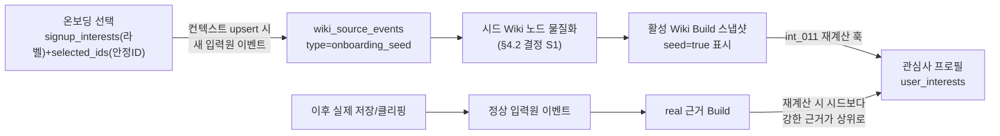

# 온보딩 콜드스타트 설계 — 관심사 시드 + 웰컴 리포트

> 상태: **Part B 구현 완료 — S1 개선 반영** · 작성일 2026-08-04 · 갱신일 2026-08-05
> 목적: 가입 직후 "관심사 0개 · 리포트 0개"인 콜드스타트를 해소한다.
> (1) 온보딩에서 고른 Category·Topic을 **관심사 시드 입력원**으로 정식 편입해 프로필을
> 채우고, (2) 가입 즉시 **웰컴 리포트 1개**를 생성해 첫 화면을 비지 않게 한다.
> 상위 설계: [wiki-interest-subscription-design.md](wiki-interest-subscription-design.md)
> (입력원 → Wiki → 관심사 프로필 → 구독의 단방향 파생 원칙).
> "확인됨"은 코드·스키마로 검증한 사실, "결정 필요"는 팀이 정해야 하는 항목이다.
> 용어: 영어 `seed`의 한국어 표기는 **시드**로 통일한다.

---

## 1. 문제

가입·온보딩 직후 사용자는 아무것도 저장한 적이 없다. 그런데:

- 관심사 프로필은 Wiki에서 파생되는 materialized view라(원칙 3), Wiki가 비면 관심사도 **0개**다.
- 리포트는 명시 요청(`topic`+`content_type`)이 있어야 생성되므로 첫 화면에 보여줄 게 **없다**.

온보딩에서 고른 Category·Topic이 있는데도 화면이 비어 있는 게 현재 상태다.

## 2. 현황 — 무엇이 배선되어 있고 무엇이 안 되어 있나 (확인됨)

| 대상 | 상태 |
|---|---|
| 온보딩 선택 저장 | `signup_interests`(라벨: `category`/`topics` 문자열)와 `selected_category_ids`·`selected_topic_ids`(안정 ID)+`interest_taxonomy_version`이 `user_context_snapshots`에 **저장만** 됨. `domain` 어디서도 소비하지 않음 — 사실상 죽은 데이터. ([mvp.py:81·105](../app/schemas/mvp.py), 커밋 661f5ab·7986e24) |
| 관심사 재계산 `int_011` | **활성 Wiki Build가 없으면 `ActiveWikiRequiredError`로 하드 실패.** ([recalculation.py:68-73](../domain/interests/features/recalculation.py)) |
| 행동-전용 후보 경로 | `int_005`는 Wiki에 없어도 양의 신호가 쌓인 Topic을 후보로 추가할 수 있음([scoring.py:221-250](../domain/interests/features/scoring.py)) — 하지만 `int_011`이 그 앞에서 활성 Wiki를 요구하므로 **가입 직후엔 도달 불가.** |
| 리포트 생성 워커 | `report_generation` Job payload에 `topic`+`content_type` **필수**([report_generation.py:35-39](../workers/features/report_generation.py)). 가입 시 자동 발행 트리거 없음. |
| Wiki 편입 파이프라인 | `wiki_source_events` → wiki build 그래프. 일반 원본은 LLM `classify_source_for_wiki`가 원문을 읽고, `onboarding_seed`는 `source_metadata.labels`를 결정적으로 Concept로 분류한다. 이후 Build 계획·저장·Snapshot·INT-011은 같은 경로를 재사용한다. |

**결론**: 온보딩 시드가 프로필로 이어지려면 반드시 **활성 Wiki Build를 만드는 경로**여야 한다. "신호만" 넣는 방식(좋아요 경로)은 `int_011`의 활성 Wiki 요구 때문에 콜드스타트에서 작동하지 않는다. → 유연님이 고른 **"온보딩 시드 입력원"** 방향이 현재 계약과 정합하는 유일한 선택.

## 3. 핵심 제약 3개

1. **`int_011`은 활성 Wiki Build를 요구한다** → 시드는 Wiki 노드 + Build 스냅샷을 남겨야 한다.
2. **일반 Wiki 노드는 원문 텍스트에서 LLM이 만든다** → 온보딩 시드는 지식 원문이 아니라 명시적 선택이므로 라벨을 결정적으로 Concept로 만들어야 한다(§4.2, 결정 S1).
3. **Agent는 안정 ID만 받고 라벨 taxonomy는 없다** — 단, `signup_interests`가 이미 사람이 읽는 라벨을 함께 보낸다. 라벨은 `signup_interests`에서, 정체성·dedup은 `selected_*_ids`에서 취한다.

## 4. Part B — 온보딩 시드 입력원

### 4.1 흐름



### 4.2 시드 Wiki 노드 생성 방식 — **결정 S1**

`int_011`이 읽을 활성 Wiki Build는 필요하지만, 합성 문서를 일반 LLM 분류에 넣을
필요는 없다. 최종 방식은 두 접근의 장점을 합친 **결정적 분류 + 기존 Build 파이프라인**이다.

- `onboarding_seed` 원본과 합성 Markdown은 멱등·감사·출처 추적을 위해 그대로 저장한다.
- Wiki Builder는 이 원본만 LLM을 건너뛰고 `source_metadata.labels`를 순서 보존·중복 제거해
  **Concept 노드**로 만든다. 노드 이름은 `topics`, 토픽이 없으면 수신부가 넣은 `category`다.
- 이후 `build_wiki_plan` → 문서/Version/출처/Chunk/Snapshot 저장 → INT-011 재계산은
  일반 원본과 동일한 경로를 재사용한다. 별도 DB 쓰기 경로를 만들지 않는다.
- 유효한 `labels`가 없으면 조용히 빈 Wiki를 만들지 않고 Build를 실패시켜 손상된 입력을 드러낸다.

따라서 가입 시 Wiki 분류 LLM 비용과 비결정성을 없애면서도 기존 저장 계약은 유지한다.

#### 기존 LLM 방식에서 확인된 부작용과 해소 (2026-08-04 E2E 검증)

(b)로 실제 파이프라인을 돌려 보니, Wiki Builder가 고른 주제 노드와 함께
**시드 문서 자체를 가리키는 상위 개념 노드**("온보딩 관심 주제")를 만들었다.
이 노드는 선택 주제 전부와 연결돼 degree가 가장 높아 **관심사 1위**를 차지했다.

| 순위 | Topic | score |
|---|---|---|
| 1 | 온보딩 관심 주제 | 1.000 |
| 2~4 | 금리 / 반도체 / 생성형 AI | 0.710 |

사용자가 선언한 관심사가 아니므로 기존에는 INT-001에서 걸러냈다. 규칙은
**"시드가 유일한 근거인 노드는 온보딩 라벨과 맞을 때만 관심 후보로 인정한다"** —
라벨은 시드 Version의 `source_metadata.labels`에서 읽는다. 실제 저장이 같은
노드에 쌓이면 근거 종류가 늘어 이 판정에서 빠지므로 그때는 후보로 되살아난다.
결정적 분류 적용 후에는 애초에 합성 문서 제목인 `온보딩`·`온보딩 관심 주제 시드`가
노드 후보가 되지 않으며, 이 필터는 과거 Build와 방어적 검증을 위해 유지한다.

### 4.3 점수 가중치 — 결정 S2

시드 노드가 실제로 관심사로 **떠오르되, 실제 근거가 쌓이면 자연히 밀려나야** 한다.

- `int_005._SOURCE_TYPE_WEIGHTS`에 `onboarding_seed` 항목 추가(잠정 `0.15` — `url`과 동급, `web_clipping` 0.2보다 낮게). ([scoring.py:26-34](../domain/interests/features/scoring.py))
- 근거 원문 시각이 없으므로 최신성은 중립값 `_NEUTRAL_RECENCY=0.5`로 들어간다(별도 처리 불필요).
- 실제 클리핑·저장(가중치 0.2~0.6)이 같은/관련 Topic에 쌓이면 재계산 시 자연히 상위로 올라가며 시드는 하위로 내려간다. **시드를 명시 삭제하지 않아도 파생 뷰가 알아서 정리**한다.

### 4.4 프로필 파생

시드 Build가 활성이 되면 기존 **INT-011 자동 재계산 훅**(wiki build 완료 시, [wiki-interest-subscription-design.md](wiki-interest-subscription-design.md) Track A1)이 그대로 동작해 `user_interests`를 채운다. 별도 파생 로직 없음.

### 4.5 라벨·정체성 매핑

- **표시 이름**: `signup_interests[].topics` (없으면 `category`).
- **안정 정체성·dedup·차단 매칭**: `selected_topic_ids`/`selected_category_ids` + `interest_taxonomy_version`을 노드 evidence에 보존. `blocked_interest_ids`(svc_001)와 같은 ID 공간을 쓰면 차단이 시드에도 바로 적용된다.
- `SignupInterest` docstring은 "`user_interests`의 `(category, topic)` 쌍으로 확장"을 언급하지만([mvp.py:84-85](../app/schemas/mvp.py)), **프로필 직접 쓰기(단방향 위배)가 아니라 Wiki 시드를 거쳐 파생**하는 것으로 해석한다.

### 4.6 원칙 1과의 관계

원칙 1은 "사용자 의사가 개입된 저장 행위만 Wiki가 된다"이다. 온보딩 선택은 콘텐츠 저장은 아니지만 **명시적 사용자 의사**다. 따라서 `onboarding_seed`를 원칙 1의 정식 입력원으로 **추가**하되, 가중치를 낮춰(§4.3) "약한 시드"로 다룬다. 자동 생성물 무단 편입(REPORT-021)과는 무관하다 — 시드는 사용자가 고른 것이다.

### 4.7 멱등·중복

- 온보딩은 여러 번 저장될 수 있다(컨텍스트 재-upsert). `onboarding_seed` 이벤트는 `(user_id, taxonomy_version, selected_ids 집합)` 기준 멱등 처리([idempotency.py](../domain/personal_wiki/source_events/features/idempotency.py) 패턴 재사용). 선택이 바뀌면 새 시드 이벤트, 빠진 선택은 다음 재계산에서 자연 하락.

## 5. Part A — 웰컴 리포트

### 5.1 트리거

**온보딩 컨텍스트 upsert의 첫 스냅샷**([agent_jobs.py:83 `upsert_user_context`](../app/services/agent_jobs.py))에서 `report_generation` Job 1개를 enqueue한다. "첫" 판정은 해당 user의 기존 스냅샷 유무로 한다(append-only 테이블).

### 5.2 topic 도출 · content_type

- **topic**: `signup_interests`에서 우선순위 1개를 뽑아 사람이 읽는 문자열로. (여러 개면 대표 1개 — 결정 A2: 첫 항목 / 최다 topic / LLM 요약 중.)
- **content_type**: 웰컴용 기본값 필요 — 결정 A1(예: 짧은 브리핑형). 리포트 워커가 `content_type`을 필수로 요구하므로 값 확정 전엔 구현 불가.
- **language**: `preferred_language`.

### 5.3 멱등·실패 격리·비용

- `idempotency_key = f"welcome:{user_id}"`로 재-upsert에도 리포트가 중복 생성되지 않게 한다([submit_generation](../app/services/agent_jobs.py) 경로 재사용).
- Job enqueue 실패가 온보딩 저장(컨텍스트 upsert)을 롤백시키면 안 된다 — **best-effort, 실패 격리**. (wiki build 완료 훅이 실패해도 Build를 유지하는 기존 패턴과 동일.)
- 비용: 가입마다 리포트 생성 LLM 호출 1회. 1회성 웰컴이므로 수용 가능하나, 봇 가입·대량 가입 시 비용 급증 가능 → 결정 A3(rate-limit/plan 게이팅 여부).

### 5.4 REPORT-021 준수

웰컴 리포트는 자동 생성물이므로 **사용자가 북마크하기 전엔 Wiki에 편입하지 않는다**([safeguards.py](../agent/report_builder/features/safeguards.py) REPORT-021). Part B 시드와 별개 경로 — 리포트가 관심사 근거로 되먹임되는 자기강화 루프를 막는다.

### 5.5 A와 B의 순서

B(시드)가 A(리포트)보다 먼저 반영되면 웰컴 리포트가 시드 관심사를 근거로 쓸 수 있어 품질이 좋다. 다만 A는 topic만 있으면 독립 실행 가능하므로 **강결합은 불필요** — 둘을 같은 upsert 처리에서 순차 enqueue하되 서로 실패 격리한다.

## 6. 결정 결과 (확정 2026-08-04)

| ID | 결정 | 결과 |
|---|---|---|
| S1 | 시드 Wiki 노드 생성 방식 | **결정적 분류 + 기존 Wiki Build** — `source_metadata.labels`를 Concept로 만들고 LLM은 건너뛰되 계획·저장·Snapshot·INT-011은 재사용(2026-08-05 개선) |
| S2 | `onboarding_seed` 가중치·최신성 취급 | **0.15**(클리핑 0.2보다 낮게)·중립 최신성 — 결정적 회귀 테스트와 로컬 E2E로 검증 |
| S3 | 시드 명시 삭제 UI 필요 여부 | **자연 하락만** — 실제 저장이 쌓이면 재계산 시 밀려남(별도 삭제 UI 없음) |
| A1 | 웰컴 리포트 `content_type` | **`interest_news_card`**(카드형, 이미 기본값) |
| A2 | 다중 선택 시 topic 선정 | **랜덤 1개** — 트리거 소유자인 Service가 선택 |
| 트리거 | 웰컴 리포트 발행 주체 | **Service**(`POST /generations`, MVP 2026-07-20 결정 준수). Agent는 시드(Part B)만 담당 |
| A3 | 웰컴 리포트 게이팅 | 미결 — 봇·대량 가입 비용은 Service 트리거와 함께 별도 논의 |

구현 현황: Part B(시드)는 `agent-api`에 구현 완료(WSE-014, 결정적 분류 포함). Part A(웰컴 리포트)는 계약 문서로
Service에 위임([service-integration-guide.md](service-integration-guide.md) §3.1,
[agent-contract.md](agent-contract.md) §4.2-1).

## 7. 비목표 (이번 범위 밖)

- 관심사 프로필 직접 편집 UI(단방향 원칙 유지).
- 온보딩 신호를 좋아요 경로(INT-005 신호)로 넣는 방식 — §2 결론대로 콜드스타트에서 작동 안 함.
- taxonomy ID→라벨 서버 사이드 매핑 테이블(현재는 `signup_interests` 라벨로 충분).

## 8. 구현 시 후속 작업 (설계 확정 후)

- `onboarding_seed` 입력원 이벤트 타입·수신부 신설 + 멱등(§4.7).
- 시드 노드/Build 물질화(S1 결정 반영) + `_SOURCE_TYPE_WEIGHTS` 항목 추가.
- `upsert_user_context` 첫 스냅샷 시 시드 이벤트 + 웰컴 리포트 Job enqueue(실패 격리·멱등).
- 새 그래프 노드가 생기면 `/dev/graphs` 레지스트리·가드 테스트 갱신(AGENTS.md 규칙 10).
- 결정적 시드 경로는 `tests/`에서 검증하고, 웰컴 리포트 LLM 품질 평가는
  다시 필요해질 때 규칙 8에 따라 새로 구성한다.
- `agent-contract.md`·`service-integration-guide.md`에 온보딩→시드/리포트 트리거 계약 반영.
```
