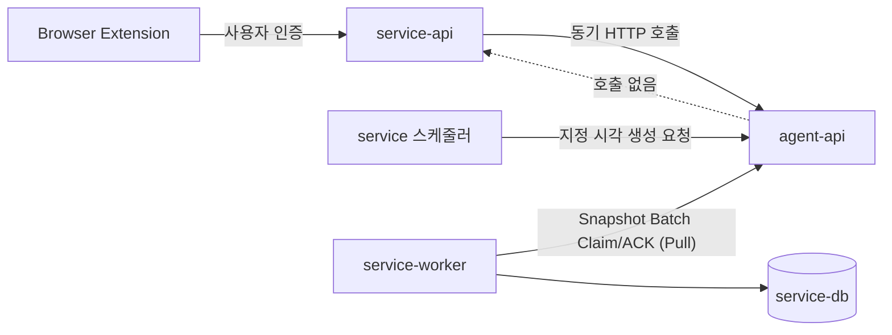

# Service 연동 가이드 (service-api · service-worker)

> 기준: 2026-07-20. Spring 계층(service-api, service-worker)이 Agent API와
> 연동할 때 구현해야 할 항목을 정리한 인수인계 문서입니다. 상세 계약은
> [fastapi-mvp-api.md](fastapi-mvp-api.md), 실행 확인은 로컬 Swagger
> (<http://127.0.0.1:8000/docs>)를 참고합니다.

## 1. 아키텍처 원칙 — 호출 방향



- 의존성은 **서비스 → 에이전트 단방향**입니다. agent-api는 service 계층을
  절대 호출하지 않으며, 콘텐츠 전달도 service-worker가 **폴링으로 가져가는
  Pull 방식**입니다.
- 따라서 service 쪽에 "agent가 호출할 수신 엔드포인트"를 만들 필요가 없습니다.

## 2. 공통 규약

| 항목 | 내용 |
|---|---|
| Base Path | `/internal/v1` (`API_PREFIX`로 변경 가능) |
| 인증 | `Authorization: Bearer <AGENT_INTERNAL_TOKEN>` — 사용자 JWT와 분리된 Agent 전용 opaque 토큰 |
| 추적 헤더 | `X-Request-ID`, `X-Trace-ID` 전달 권장 (누락 시 agent가 생성) |
| 비동기 계약 | 쓰기 요청은 DB Commit 후 `202 Accepted` + `job_id` 반환. 완료 여부는 Job 조회로 확인 |
| 오류 구조 | 모든 오류는 `{code, message, request_id, retryable, details}` 공통 JSON |
| 멱등성 | 클리핑·URL은 `source_event_id`, 생성은 `idempotency_key`로 중복 방지. 같은 키 재요청은 기존 결과를 반환 |

## 3. service-api가 구현할 것

### 3.1 사용자 컨텍스트 동기화 (최우선 — 다른 기능의 전제)

`PUT /internal/v1/users/{user_id}/context`

| 필드 | 필수 | 설명 |
|---|---|---|
| `context_version` | O | **단조 증가 정수.** 같거나 작은 버전은 `409 STALE_CONTEXT_VERSION` |
| `plan` | O | `free` \| `paid` |
| `preferred_language` | X | 기본 `ko` |
| `personalization_enabled` | X | 기본 `true` |
| `interest_taxonomy_version` | X | 선택 ID를 해석할 Service 관심사 분류체계 버전 |
| `selected_category_ids` | X | 온보딩에서 선택한 Category 안정 ID 목록(최대 8개) |
| `selected_topic_ids` | X | 온보딩에서 선택한 Topic 안정 ID 목록(최대 12개) |
| `blocked_interest_ids` | X | 차단 관심사 ID 목록 |
| `blocked_source_ids` | X | 차단 Source ID 목록 |
| `signup_interests` | X | 회원가입 시 고른 관심 카테고리·토픽 시드. `[{"category": "기술", "topics": ["AI", "반도체"]}, ...]` — 카테고리만 골랐으면 `topics`는 빈 배열. 생략하면 빈 목록으로 저장 |

- 호출 시점: **회원가입 직후 1회(필수)** + 플랜·언어·차단 설정 변경 시마다.
- `signup_interests`는 사용자가 **선언한** 관심사 시드다. 위키에서 파생·재계산되는
  관심사 프로필과 달리 재계산으로 지워지지 않도록 버전 관리되는
  `agent.user_context_snapshots.attributes`에 함께 보존한다.
- **콜드스타트 관심사 시드 (WSE-014, 자동)**: `signup_interests`가 있으면 이 컨텍스트
  수신 시 Agent가 온보딩 선택을 시드 Markdown으로 합성해 `onboarding_seed` 원본과
  Personal Wiki Build Job으로 **자동 접수**한다. Builder는 저장된 `labels`를 LLM 없이
  결정적으로 Concept로 만들고, 이후 기존 Build·Snapshot·INT-011 경로를 재사용한다.
  따라서 합성 문서 제목은 Wiki 노드가 되지 않는다. 빌드가 끝나면 기존 INT-011 훅이
  관심사 프로필을 파생시켜, 아무것도 저장하지 않은 신규 사용자도 관심사가 비지 않는다.
  Service의 추가 호출은 필요 없다. 이 접수는 컨텍스트 저장과 분리된 best-effort이며,
  선택 내용 기반 멱등이라 같은 온보딩이 반복 전달돼도 시드는 한 번만 만들어진다.
- **가입 즉시 웰컴 리포트 (Service 트리거)**: "가입하자마자 리포트 1개"는 생성 트리거라
  MVP 결정(2026-07-20)상 **Service 소유**다. Service가 온보딩 완료 직후
  `POST /internal/v1/users/{user_id}/generations`를 아래 값으로 1회 호출한다.
  - `topic`: `signup_interests`에서 고른 대표 관심사(여러 개면 랜덤 1개)
  - `content_type`: `interest_news_card` (기본값)
  - `idempotency_key`: `welcome:{user_id}` — 멱등키로 재호출해도 리포트는 1개만 생성됨
- ⚠️ 컨텍스트가 없는 사용자의 생성 요청은 `409 USER_CONTEXT_REQUIRED`로
  거부됩니다. 가입 플로우에 반드시 포함하세요.
- ⚠️ `blocked_*_ids`의 ID 체계(무엇의 ID인지)는 아직 양팀 미합의 상태입니다.
  합의 전까지 agent는 저장만 하고 필터링에 사용하지 않습니다(§7 참고).

### 3.2 웹 클리핑 중계

`POST /internal/v1/users/{user_id}/wiki-sources/clippings` — Extension의
사용자 인증을 service-api가 처리한 뒤 이 내부 경로로 중계합니다.

| 필드 | 필수 | 설명 |
|---|---|---|
| `source_event_id` | O | 사용자 안에서 유일한 멱등 키 (1~128자) |
| `source` | O | 원문 URL (`url` 별칭도 허용) |
| `title` | O | 1~500자 |
| `content` | O | Markdown 본문. **요청 전체 2 MiB 제한** (`413 CLIPPING_CONTENT_TOO_LARGE`) |
| `author`, `published`, `created`, `description`, `tags`, `occurred_at`, `memo` | X | 메타데이터 |

- 응답: `202` + `job_id`, `source_document_id`, `source_document_version_id`.
- 같은 `source_event_id` + 같은 Payload 재요청 → 기존 결과 반환 (새 Row 없음).
  같은 키 + **다른** Payload → `409 CLIPPING_SOURCE_EVENT_CONFLICT`.
- 202는 "원문과 Job이 영속 저장됨"이지 "Wiki 생성 완료"가 아닙니다.

### 3.3 URL 등록

`POST /internal/v1/users/{user_id}/wiki-sources/urls`

| 필드 | 필수 | 설명 |
|---|---|---|
| `source_event_id` | O | 멱등 키 |
| `url` | O | 수집할 URL (Jina Reader로 본문 수집) |
| `occurred_at`, `memo` | X | 메타데이터 |

- 응답 시점에는 URL Head와 `personal_wiki_url` Job까지 Agent DB에 저장됩니다.
- 상주 `url-collection` Worker가 Job을 감지해 Jina Reader로 본문을 읽고 Markdown
  원본 Version으로 저장합니다. 새 Version이면 후속 `personal_wiki_build` Job을
  등록하므로, Service가 별도의 실행 API를 호출할 필요는 없습니다.
- Jina 수집 실패는 Job과 Source Event에 기록되고 재시도 정책을 따르며, URL 저장
  요청 자체의 202 응답을 되돌리지 않습니다.

### 3.4 콘텐츠 생성 요청 + 사용자 지정 시간 스케줄러

`POST /internal/v1/users/{user_id}/generations`

| 필드 | 필수 | 설명 |
|---|---|---|
| `idempotency_key` | O | **`{schedule window}-{user_id}-{content_type}` 규칙 권장** (예: `2026-07-21-user-1-interest_news_card`). 스케줄러 재시도·중복 실행에도 Job이 한 번만 생김 |
| `generation_scope` | X | 기본 `SINGLE_TOPIC`. 특정 활성 LLM Wiki 관심사와 연결 노드를 묶을 때 `INTEREST_BUNDLE` |
| `topic` | 조건부 | `SINGLE_TOPIC`에서 필수(1~500자). `INTEREST_BUNDLE`에서는 생략하며 Agent가 활성 관심사 루트로 확정 |
| `interest_id` | 조건부 | `INTEREST_BUNDLE`에서 필수. **온보딩 taxonomy ID가 아니라 현재 활성 `user_interests.id` UUID** |
| `topics` | X | 서로 독립된 여러 주제를 한 장에 묶는 기존 아침요약 입력. `INTEREST_BUNDLE`과 함께 사용 불가 |
| `content_type` | X | 기본 `interest_news_card` |
| `report_type` | X | Service 소유 생성 맥락. Agent가 해석하지 않고 Snapshot에 반환 |
| `language` | X | 생략 시 컨텍스트의 선호 언어 사용 |
| `scheduled_at` | X | 실행 예약 시각. **시간대 필수** (`2026-07-21T07:00:00+09:00`). 시간대 없으면 `422`. 생략 시 즉시 실행 대상 |

특정 관심분야 리포트 요청 예시:

```json
{
  "idempotency_key": "interest-bundle:2026-08-07:user-1:33333333-3333-4333-8333-333333333333",
  "generation_scope": "INTEREST_BUNDLE",
  "interest_id": "33333333-3333-4333-8333-333333333333",
  "content_type": "interest_news_card",
  "report_type": "ON_DEMAND"
}
```

Agent는 접수 시 관심사가 현재 활성 Profile에 속하고 차단되지 않았는지 검증한 뒤,
루트와 최대 2개의 Wiki 1홉 노드를 Job에 고정합니다. 비활성·차단 관심사는
`409 ACTIVE_INTEREST_REQUIRED`입니다.

**사용자 지정 시간 스케줄은 service 쪽 책임입니다** (2026-07-20 결정 —
사용자 설정의 원천이 service-db이기 때문). 구현 방식은 둘 중 선택:

1. **정시 호출**: service 스케줄러(`@Scheduled` 등)가 사용자 지정 시각에
   이 API를 호출 (`scheduled_at` 생략)
2. **사전 예약**: 미리 호출하되 `scheduled_at`에 실행 시각 지정 — Agent
   Worker가 그 시각 전에는 Job을 집지 않음

같은 `idempotency_key` 재등록은 기존 Job을 재사용하며 예약 시각을 바꾸지
않습니다. 시각 변경이 필요하면 새 window 키로 등록하세요.

### 3.5 Job 상태·결과 폴링

| Method / Path | 용도 |
|---|---|
| `GET /internal/v1/jobs/{job_id}` | 상태(`queued`/`running`/`completed`/`failed`/`cancelled`)와 진행률 |
| `GET /internal/v1/jobs/{job_id}/result` | 완료 결과. 미완료 시 `409 JOB_RESULT_NOT_READY` |

### 3.6 조회 API (화면 데이터)

별도 등록 없이 바로 호출 가능한 읽기 계약입니다.

| Path | 내용 |
|---|---|
| `GET /users/{user_id}/wiki/documents` (+`/{document_id}`) | Wiki 문서 목록·상세(Markdown 포함) |
| `GET /users/{user_id}/wiki/graph` | Entity·Concept 관계 그래프 (Node·Edge·통계) |
| `GET /users/{user_id}/wiki/graph/top-nodes?limit=10` | 연결 많은 순 상위 Node (rank·degree 포함 경량 응답) |
| `GET /users/{user_id}/interests` | 활성 관심 키워드 (topic·score·evidence) |
| `POST /users/{user_id}/interest-profiles/rebuild` | 관심 키워드 수동 재계산 (Wiki Build 완료 시 자동 재계산되므로 새로고침·복구용) |
| `GET /users/{user_id}/generated-contents` (+`/{candidate_id}`) | 생성 콘텐츠 목록·상세(본문·Citation) |

### 3.6-1 행동 신호 전달 (2026-07-27 구현)

- **피드백 신호** (`POST .../feedback-signals`): 좋아요·좋아요 취소·숨김·신고를
  Batch(최대 100건)로 전달합니다. 각 신호에 `topics`(신호가 가리키는 관심
  Topic, Service가 해석)와 `source_event_id`(멱등 키)를 포함하세요. Wiki
  문서를 만들지 않으며, **다음 관심사 재계산 때** INT-005가 시간 감쇠와 함께
  점수에 반영합니다(가중치는 잠정값 — D2 확정 시 변경 가능). 즉시 반영이
  필요하면 `POST .../interest-profiles/rebuild`를 이어서 호출하세요.

### 3.7 리포트 북마크 위키 편입 (2026-07-27 구현 / 2026-07-30 통합)

- **북마크 편입** (`POST .../wiki-sources/content-marks`): 사용자가 북마크한
  리포트(`content_id` = 후보 ID 또는 논리 content_id)를 `content_mark` 원본
  Version으로 물질화하고 기존 `personal_wiki_build` Job으로 처리합니다(202).
  대상 리포트가 없으면 `404 GENERATED_CONTENT_NOT_FOUND`. `source_event_id`
  기준 멱등 접수입니다.
- **내 리포트와 다른 사용자(피드) 리포트를 구분하지 않습니다.** 같은 엔드포인트에
  `content_id`만 넘기면 작성자와 무관하게 편입됩니다(Agent가 자기 DB의 원본
  본문을 물질화하므로 Service는 본문을 다시 실어 보낼 필요가 없습니다).
- ⚠️ **열람 권한(비공개·차단) 판단은 Service 소유**입니다. Agent는 전달받은
  `content_id`를 실행만 하므로, 사용자가 볼 수 없는 리포트의 `content_id`가
  넘어오지 않도록 Service가 피드 노출 기준으로 게이팅하세요.
- **사용자가 명시적으로 북마크했을 때만 호출**하세요 — 자동 호출은
  REPORT-021(자동 Wiki 편입 금지) 위반입니다.

### 3.8 개인 Wiki 문서 삭제 (2026-07-27 구현)

- **문서 삭제** (`POST .../wiki-sources/deletions`): `document_id`의 Wiki 문서를
  soft-delete하고 Chunk를 검색에서 즉시 제외합니다(동기 200, `source_event_id`
  멱등 — 이미 삭제된 문서 재요청은 `already_deleted=true`). 없는 문서는
  `404 WIKI_DOCUMENT_NOT_FOUND`. **삭제 정책 판단(권한·확인 UX)은 Service
  소유**이며 Agent는 실행만 합니다. 같은 개념이 새 클리핑으로 재등장하면 새
  문서로 되살아납니다(D1 잠정: 기본 부활 — 억제(tombstone) 옵션은 팀 결정 후).
  관심사 반영이 급하면 `POST .../interest-profiles/rebuild`를 이어서 호출하세요.

## 4. service-worker가 구현할 것 — 발행 폴링 루프

생성 완료 콘텐츠를 service-db로 옮기는 유일한 경로입니다. **10~30초 주기의
폴링 루프** 하나면 됩니다 (이벤트 수신은 MVP 이후 지연 최적화로 추가 예정).

```text
loop (10~30초):
  1. POST /internal/v1/publish-snapshot-batches/claim
     { "worker_id": "service-worker-01", "limit": 50, "lease_seconds": 120 }
  2. items가 비어 있으면 다음 주기까지 대기
  3. 각 item을 content_id + version 키로 service-db에 멱등 Upsert
     (항목별 독립 Transaction — Batch 전체를 한 Transaction으로 묶지 않기)
  4. POST /internal/v1/publish-snapshot-batches/{batch_id}/ack
     처리 끝난 항목만 담아 부분 성공 ACK
```

### Claim 응답

`batch_id`, `lease_expires_at`과 함께 각 item에 **전체 Payload**(content_id,
user_id, version, snapshot_hash, title, summary, body, citations, tags와 생성 범주
메타데이터)가 포함되므로
추가 조회 없이 바로 Upsert할 수 있습니다. 처리할 것이 없으면 `items=[]`.

**`tags`(2026-07-30 추가)** — 카드에 노출할 관심사 태그 목록입니다.

```json
"tags": ["코스피"]
```

- 값은 생성 요청의 `topic`을 그대로 실은 것입니다. 리포트 1건은 topic 1개로
  생성되므로 **항상 원소가 1개**입니다(배열인 것은 확장 여지를 남긴 것).
- service 워커는 이 문자열을 `card_interest_tags`에 그대로 저장·노출합니다.
  `/interests`의 topic과 일치시킬 필요는 없습니다(2026-07-30 송우 확인).
- 이 필드가 붙기 전에 저장된 Snapshot에는 없어서 `[]`로 내려갑니다.

**범주 생성 추적 필드(2026-08-07 추가)**

- `generation_scope`: `SINGLE_TOPIC` 또는 `INTEREST_BUNDLE`
- `source_interest_id`: 범주 생성의 원천 활성 관심사 UUID. 단일 주제는 `""`
- `interest_profile_id`: 묶음을 확정한 활성 Profile UUID. 단일 주제는 `""`
- `bundle_keywords`: 루트부터 시작하는 실제 검색 키워드 스냅샷. 단일 주제는 `[]`

Service는 이 필드로 어떤 LLM Wiki 관심사와 연결 노드가 카드 생성에 쓰였는지
추적할 수 있습니다. `tags`의 기존 의미는 바뀌지 않으며 여전히 루트 주제 문자열
하나입니다.

**`citations`는 `{citation_id, title, url}` 세 필드뿐입니다.**

```json
"citations": [
  { "citation_id": "…", "title": "환율 월평균 39.1원 …", "url": "https://view.asiae.co.kr/…" }
]
```

⚠️ **출처 종류(개인 Wiki / 수집 캐시 / 실시간)는 이 payload에 실리지 않습니다.**
agent 쪽에는 셋을 구분하는 정보가 있지만(`agent-contract.md` §3.1), claim 응답에는
빠져 있어 워커가 종류를 알 수 없습니다.

- `url`이 비어 있으면 개인 Wiki 출처입니다(위키엔 외부 URL이 없습니다). 이건 구분됩니다.
- 반면 **수집 캐시(G)와 실시간(L)은 둘 다 `url`이 있어 구별되지 않습니다.** 차이는
  캐시본이 우리 DB에 보존돼 원문이 바뀌어도 근거를 확인할 수 있다는 점입니다.

화면에서 이 둘을 다르게 보여줄 계획이면 payload에 종류 필드를 추가해야 합니다.
필요해지면 알려주세요 — `tags` 때와 같이 필드 추가로 처리할 수 있습니다.

> **왜 태그 엔티티가 아니라 문자열인가 (2026-07-30 합의: 송우·유림)**
>
> 태그를 `tags(id, name)` + `card_tags` 연결 테이블로 정규화하는 방식도
> 검토했다(Instagram Graph API가 해시태그를 id 가진 독립 객체로 다루는 방식).
> **MVP에서는 문자열 저장으로 마무리한다** — 지금 필요한 건 카드에 표시하는
> 것뿐이고, 검색·필터는 이번 범위가 아니기 때문이다.
>
> **정규화를 다시 꺼낼 시점은 "이 태그를 가진 연관 글 검색"이 들어올 때**다.
> 그때 service 쪽은 태그 엔티티 + 연결 테이블로 옮기고(소유: 영현·우석),
> agent 쪽은 payload에 문자열 대신 태그 식별자를 실을지 재협의가 필요하다.
> 그전까지 이 payload 계약은 문자열 그대로 유지한다.

### ACK 규칙

| 필드 | 설명 |
|---|---|
| `worker_id` | Claim 때와 동일해야 함 (`409 PUBLISH_BATCH_OWNERSHIP_MISMATCH`) |
| `items[].status` | `published` \| `failed` |
| `items[].retryable` | 실패 시 필수 — `true`면 Backoff 후 `ready` 복귀, `false`면 최종 `failed` |
| `items[].snapshot_hash` | Claim 응답 값 그대로 — 불일치 시 `409 PUBLISH_SNAPSHOT_MISMATCH` |

- ACK에 넣지 않은 항목은 Lease 만료 후 자동으로 다시 Claim 대상이 됩니다 —
  처리 중 Worker가 죽어도 유실 없음.
- 같은 batch_id·항목 재-ACK는 이전 결과를 반환하며 이력을 중복 생성하지
  않습니다. 즉 **ACK 재시도는 안전**합니다.
- Lease 만료 후 ACK는 `409 PUBLISH_BATCH_LEASE_EXPIRED` — 해당 Batch는
  버리고 다음 Claim부터 다시 처리하면 됩니다.

## 5. 오류 코드 요약

| Code | HTTP | 서비스 쪽 대응 |
|---|---:|---|
| `INVALID_INTERNAL_TOKEN` | 401 | `Authorization: Bearer` 헤더와 배포 Secret 일치 여부 확인 |
| `INTERNAL_AUTH_NOT_CONFIGURED` | 503 | Agent 배포 환경의 `AGENT_INTERNAL_TOKEN` 설정 후 재기동 |
| `REQUEST_VALIDATION_ERROR` | 422 | 요청 형식 수정 (details에 필드별 사유) |
| `USER_CONTEXT_REQUIRED` | 409 | 컨텍스트 먼저 PUT 후 재시도 |
| `STALE_CONTEXT_VERSION` | 409 | 더 큰 `context_version`으로 재전송 |
| `CLIPPING_CONTENT_TOO_LARGE` | 413 | 2 MiB 초과 — 사용자에게 안내 |
| `CLIPPING_SOURCE_EVENT_CONFLICT` | 409 | 같은 이벤트 키에 다른 내용 — 새 키 발급 |
| `JOB_NOT_FOUND` | 404 | job_id 확인 |
| `JOB_RESULT_NOT_READY` | 409 | 잠시 후 재조회 |
| `PUBLISH_SNAPSHOT_MISMATCH` | 409 | Claim 응답의 version·hash로 재검증 |
| `PUBLISH_BATCH_OWNERSHIP_MISMATCH` | 409 | worker_id 확인 |
| `PUBLISH_BATCH_LEASE_EXPIRED` | 409 | Batch 폐기 후 재-Claim |
| `SERVICE_NOT_READY` | 503 | retryable — Backoff 후 재시도 |
| `INTERNAL_SERVER_ERROR` | 500 | retryable — Backoff 후 재시도 |

## 6. 권장 구현 순서

- [ ] 1. 사용자 컨텍스트 동기화 (가입 훅 + 설정 변경 훅) — §3.1
- [ ] 2. 클리핑·URL 중계 (Extension 경로 연결) — §3.2, §3.3
- [ ] 3. Job 상태 폴링과 화면 조회 API 연동 — §3.5, §3.6
- [ ] 4. 콘텐츠 생성 요청 + 지정 시간 스케줄러 — §3.4
- [ ] 5. service-worker 발행 폴링 루프 — §4

1~2만 되면 "클리핑 → Wiki" 흐름이, 4~5까지 되면 "생성 → 사용자 피드"까지
전체 루프가 완성됩니다.

## 7. 양팀이 함께 결정할 항목

| 항목 | 내용 | 시점 |
|---|---|---|
| 내부 인증 | Agent 전용 opaque Bearer 토큰 적용. Service의 모든 Agent HTTP Client가 공통 헤더를 전송 | 구현 시 필수 |
| 차단 ID 매핑 | `blocked_interest_ids`·`blocked_source_ids`가 무엇의 ID인지 (키워드 문자열 / 도메인 / agent 관심사 UUID) — 확정돼야 agent가 검색·생성 필터에 반영 | 개인화 고도화 전 |
| 회원 탈퇴 삭제 | 탈퇴 시 agent 데이터(클리핑 원문·Wiki) 삭제 API — agent 쪽 미구현 | 서비스 오픈 전 |
| `CONTENT_READY` 이벤트 | 폴링 지연을 줄이는 Push 신호 (Outbox 기록까지는 구현됨) | MVP 이후 |
