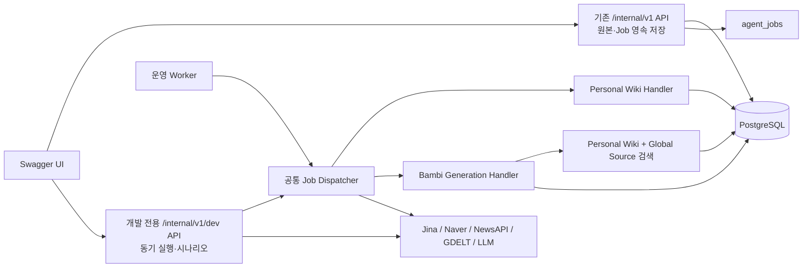

# Swagger 기반 Agent 개발 테스트 계획

## 1. 목적

개발자가 Swagger UI에서 다음 흐름을 단계별 또는 한 번에 실행하고, 실제
PostgreSQL 저장 결과를 조회할 수 있게 한다.

1. URL 또는 웹 클리핑 Markdown을 사용자 원본으로 저장한다.
2. Personal Wiki Builder Agent를 즉시 실행해 Entity·Concept·Schema Wiki를 만든다.
3. 생성된 LLM Wiki의 문서, 버전, 관계를 조회한다.
4. 사용자 Wiki에서 관심 키워드를 추출한다.
5. 키워드로 최신 외부 정보를 수집·검색한다.
6. 개인 Wiki와 최신 정보를 함께 사용해 Bambi 콘텐츠를 생성한다.
7. 생성 콘텐츠와 Citation을 조회한다.

이 API는 개발·통합 테스트를 위한 실행 표면이다. 운영 API의 비동기 Job 계약을
동기 처리로 바꾸지 않고, 운영 Worker가 사용하는 동일한 Use Case와 Job Handler를
개발 전용 API에서 직접 호출한다.

## 2. 현재 구현 상태

| 영역 | 현재 상태 | 계획에서 필요한 조치 |
|---|---|---|
| 클리핑·URL·생성 API | Swagger 경로는 있으나 `AgentApiMvpService`가 인메모리 Job을 생성함 | PostgreSQL 원본·Job 저장 Use Case로 교체 |
| URL 원본 저장 | Jina Reader 수집, 원본 Version 저장, Wiki Job 등록 CLI가 있음 | Connector와 저장 로직을 API용 Service로 추출 |
| 클리핑 원본 저장 | DB 구조와 Seed는 있으나 API가 실제 저장 경로에 연결되지 않음 | 전체 Frontmatter 필드 수신 및 Transaction 저장 구현 |
| Wiki Builder | `build_incremental_wiki`와 Wiki 저장 로직이 있음 | Job Handler와 동기 개발 실행 경로 연결 |
| Wiki 조회 | Entity·Concept Graph 조회만 구현됨 | 문서 목록·Markdown 상세·Build Version 조회 추가 |
| 관심 키워드 | 저장 테이블은 있으나 추출 실행 경로가 없음 | Wiki 기반 추출·근거·Profile 저장 구현 |
| 최신 정보 | Global Source DB 구조는 있으나 Agent 검색 Tool은 미구현 | Connector 실행, 정규화, Global 검색 구현 |
| Bambi Agent | Orchestration, 검색, 생성, Citation, 저장이 대부분 미구현 | 최소 생성 파이프라인부터 구현 |
| Worker 실행 | Job Claim/완료·실패 저장 함수는 있으나 실행 Dispatcher가 없음 | Job Type별 Handler와 `run` 진입점 구현 |

핵심 병목은 Swagger가 아니라 Bambi와 검색 Use Case다. 따라서 Swagger 전용
가짜 결과를 만들지 않고, 각 기능을 실제 Worker 경로에 먼저 연결한다.

## 3. 권장 구조



### 구조 원칙

- 기존 `/internal/v1` 쓰기 API는 DB Commit 후 `202 Accepted`와 `job_id`를 반환한다.
- `/internal/v1/dev`만 요청 Thread에서 Job Handler를 동기 실행한다.
- 개발 API와 운영 Worker가 같은 Handler를 사용해 실행 결과가 달라지지 않게 한다.
- 외부 HTTP·LLM 호출 중에는 긴 DB Transaction을 유지하지 않는다. 입력 저장,
  외부 실행, 결과 저장을 각각 명확한 경계로 분리한다.
- 단계가 실패하면 이미 저장한 원본이나 성공한 이전 결과를 삭제하지 않는다.
  `failed_stage`, 재시도 가능 여부와 관련 ID를 반환한다.
- 개발 API는 `APP_ENV`가 `local` 또는 `test`이고
  `ENABLE_DEV_AGENT_API=true`일 때만 Router와 OpenAPI에 등록한다.
- 개발 API를 Loopback 밖에 노출할 때는 `DEV_AGENT_API_TOKEN`을 요구한다.

## 4. Swagger API 설계

### 4.1 기존 운영 계약을 실제 영속 경로로 전환

| 기능 | Method / Path | 결과 |
|---|---|---|
| 클리핑 저장·Job 등록 | `POST /internal/v1/users/{user_id}/wiki-sources/clippings` | `source_document_id`, `source_document_version_id`, `job_id` |
| URL 저장·수집 Job 등록 | `POST /internal/v1/users/{user_id}/wiki-sources/urls` | `source_document_id`, `job_id` |
| 콘텐츠 생성 Job 등록 | `POST /internal/v1/users/{user_id}/generations` | `generation_request_id`, `job_id` |
| Job 상태 | `GET /internal/v1/jobs/{job_id}` | 상태, 진행 단계, 오류 |
| Job 결과 | `GET /internal/v1/jobs/{job_id}/result` | Wiki 또는 생성 결과 ID |

클리핑 Request는 아래 필드를 모두 받도록 현재 Schema를 확장한다.

| 필드 | 필수 여부 | 저장 위치 |
|---|---|---|
| `source_event_id` | 필수 | `wiki_source_events` 멱등 Key |
| `title` | 필수 | `user_source_document_versions.title` |
| `source` | 필수 | `user_source_documents.canonical_url` |
| `author` | 선택 | `user_source_document_versions.author` |
| `published` | 선택 | `user_source_document_versions.published_at` |
| `created` | 선택 | `user_source_document_versions.clipped_on` |
| `description` | 선택 | `user_source_document_versions.description` |
| `tags` | 선택 | `user_source_document_versions.tags` |
| `content` | 필수 | `user_source_document_versions.raw_content` |
| `memo` | 선택 | Source Event Metadata |

### 4.2 개발 전용 단계 실행 API

| Swagger Tag | Method / Path | 용도 |
|---|---|---|
| `dev-jobs` | `POST /internal/v1/dev/jobs/{job_id}/run` | 등록된 Job 하나를 실제 Handler로 즉시 실행 |
| `dev-wiki` | `POST /internal/v1/dev/users/{user_id}/wiki-builds` | `source_document_version_id`를 지정해 Wiki Builder만 직접 실행 |
| `dev-interests` | `POST /internal/v1/dev/users/{user_id}/interest-profiles/rebuild` | 활성 Wiki에서 키워드·점수·근거를 추출하고 새 Profile 저장 |
| `dev-global` | `POST /internal/v1/dev/users/{user_id}/latest-information/search` | 사용자 키워드 또는 직접 입력 키워드로 최신 자료 수집·검색 |
| `dev-bambi` | `POST /internal/v1/dev/users/{user_id}/bambi-generations` | 선택한 Wiki Version과 최신 자료로 Bambi를 동기 실행 |
| `dev-scenarios` | `POST /internal/v1/dev/users/{user_id}/scenarios/source-to-content` | 원본 입력부터 콘텐츠 저장까지 전체 흐름 실행 |

명시적 기능별 Request Schema를 사용한다. 범용
`POST /agents/{agent_name}` 형태는 Swagger 문서성과 검증이 약해 사용하지 않는다.

공통 동기 실행 응답은 다음 정보를 포함한다.

```json
{
  "run_id": "uuid",
  "job_id": "uuid-or-null",
  "status": "completed",
  "started_at": "2026-07-16T10:00:00+09:00",
  "duration_ms": 12540,
  "stages": [
    {"name": "wiki_build", "status": "completed", "duration_ms": 8210}
  ],
  "result_refs": {
    "wiki_version_id": "uuid",
    "content_candidate_id": "uuid"
  },
  "usage": {"input_tokens": 0, "output_tokens": 0, "estimated_cost": 0},
  "warnings": []
}
```

### 4.3 조회 API

조회는 개발 전용이 아니라 service-api도 사용할 수 있는 기존 `/internal/v1`
계약으로 구현한다.

| 기능 | Method / Path | 주요 응답 |
|---|---|---|
| Wiki 문서 목록 | `GET /internal/v1/users/{user_id}/wiki/documents` | kind, key, path, title, 현재 Version |
| Wiki 문서 상세 | `GET /internal/v1/users/{user_id}/wiki/documents/{document_id}` | Frontmatter 포함 Markdown, 출처, 관계 |
| Wiki Build 상세 | `GET /internal/v1/users/{user_id}/wiki/versions/{wiki_version_id}` | 해당 Build의 문서 Version 구성 |
| Wiki Graph | 기존 `GET /internal/v1/users/{user_id}/wiki/graph` | Entity·Concept Node와 관계 |
| 관심 키워드 | `GET /internal/v1/users/{user_id}/interests` | topic, score, confidence, evidence |
| 생성 콘텐츠 목록 | `GET /internal/v1/users/{user_id}/generated-contents` | content ID, Version, 상태, 제목 |
| 생성 콘텐츠 상세 | `GET /internal/v1/users/{user_id}/generated-contents/{candidate_id}` | 본문, 요약, Citation, 실행 정보 |

### 4.4 전체 시나리오 API

`source-to-content`는 아래 Stage를 순서대로 실행한다.

1. `source_ingestion`: URL이면 Jina Reader로 Markdown을 가져오고, 클리핑이면 전달된 Markdown을 저장한다.
2. `wiki_build`: 원본 Version으로 Entity·Concept·Schema를 생성 또는 갱신한다.
3. `interest_extraction`: 활성 Wiki에서 관심 키워드와 근거를 만든다.
4. `latest_collection`: Naver, NewsAPI, GDELT 중 지정 Provider로 최신 정보를 수집한다.
5. `context_retrieval`: 개인 Wiki와 Global 문서를 Hybrid Search한다.
6. `bambi_generation`: 제목·요약·본문·Citation을 생성한다.
7. `result_persistence`: 생성 후보와 실행 정보를 저장한다.

Source 입력은 URL과 클리핑의 Discriminated Union으로 정의해 Swagger에서 두
형태를 명확하게 선택할 수 있게 한다. 이 API는 각 Stage의 ID와 소요 시간을
반환하며, 실패 시 `failed_stage`와 완료된 Stage 결과를 함께 반환한다.

## 5. 데이터 저장 매핑

| 산출물 | 테이블 |
|---|---|
| 클리핑·URL 식별자와 처리 상태 | `wiki_source_events`, `user_source_documents` |
| Frontmatter·Markdown 원본 Version | `user_source_document_versions` |
| 비동기 실행 상태와 시도 | `agent_jobs`, `agent_job_attempts` |
| Entity·Concept·Schema Head와 Markdown Version | `wiki_documents`, `wiki_document_versions` |
| 원본 연결·문서 관계·Build Snapshot | `wiki_document_sources`, `wiki_document_relations`, `wiki_versions`, `wiki_version_documents` |
| 검색 Chunk·Embedding | `wiki_chunks`, `wiki_embeddings` |
| 관심 키워드와 근거 | `user_interest_profiles`, `user_interests`, `interest_evidence` |
| 최신 정보 수집 실행 | `global_sources`, `global_collection_runs` |
| 정규화된 최신 문서 | `wiki_documents`·`wiki_document_versions`의 `namespace_key = global` |
| 생성 요청·실행·결과 | `generation_requests`, `generation_runs`, `generated_content_candidates` |
| 생성 근거 | `citations` |

최신 검색 결과를 개인 Wiki Namespace에 복사하지 않는다. 최신 자료는 Global
Namespace에 보존하고, 생성 결과가 실제 사용한 개인·Global 문서 Version을
Citation으로 연결한다.

## 6. 구현 순서와 Sprint 계획

### 용량 가정

- Backend 개발자 1명, Sprint 2주(10일)
- 총 60시간 중 회의·리뷰·예상 밖 수정 20%를 제외한 48시간
- Sprint당 24 Point를 상한으로 두고 21 Point만 확정해 3 Point를 Buffer로 유지
- 실제 팀 인원이나 Sprint 길이가 다르면 Point 비율을 유지해 재계산

### Sprint 1 — 원본에서 LLM Wiki까지 (21 Point)

**Sprint Goal:** Swagger에서 클리핑 또는 URL을 저장하고 실제 Wiki Builder를 즉시
실행한 뒤 Markdown 문서를 조회할 수 있다.

| 순서 | 작업 | Point | 의존성 | 완료 조건 |
|---|---|---:|---|---|
| 1 | 개발 Router, 환경 Gate, Token, OpenAPI Tag 추가 | 2 | 없음 | 운영 환경에서는 경로 자체가 등록되지 않음 |
| 2 | 클리핑·URL PostgreSQL Ingestion Service 구현 | 5 | 1 | 원본·Version·Job이 같은 저장 계약으로 Commit됨 |
| 3 | Wiki Job Handler·Dispatcher와 즉시 실행 API 구현 | 5 | 2 | 등록 Job과 직접 Build가 같은 Handler를 호출함 |
| 4 | Wiki 목록·상세·Build 조회 API 구현 | 3 | 3 | 사용자 Namespace와 RLS가 적용됨 |
| 5 | 멱등성·실패·Provider Mock 통합 테스트 | 4 | 2~4 | 실제 외부 호출 없이 전체 흐름 자동 검증 |
| 6 | Swagger Example, 오류 응답, 실행 Trace 정리 | 2 | 1~5 | Swagger만으로 수동 재현 가능 |

Sprint 1 종료 시 `URL/클리핑 → 원본 저장 → LLM Wiki 즉시 생성 → 조회`가
완성된다. 이 시점이 첫 번째 사용 가능한 Thin Slice다.

### Sprint 2 — 키워드와 최신 정보 (21 Point)

**Sprint Goal:** 활성 개인 Wiki에서 관심 키워드를 만들고, 키워드와 관련된 최신
Global 문서를 수집·검색할 수 있다.

| 순서 | 작업 | Point | 의존성 | 완료 조건 |
|---|---|---:|---|---|
| 1 | 관심 키워드 추출·점수·근거·Profile Version 구현 | 4 | Sprint 1 | 재실행 시 새 Profile Version과 active 전환이 원자적임 |
| 2 | Personal Wiki Keyword·Vector Hybrid Search 구현 | 5 | Sprint 1 | 사용자 Namespace 강제, 점수와 문서 Version 반환 |
| 3 | Naver·NewsAPI·GDELT Provider Adapter와 정규화 구현 | 6 | 없음 | Provider별 결과가 공통 문서 Schema로 저장됨 |
| 4 | 최신 정보 검색 API와 Global Namespace 검색 구현 | 3 | 1~3 | 기간·언어·Provider·limit 조건 지원 |
| 5 | 중복 URL, 최신성, Provider 장애 통합 테스트 | 3 | 3~4 | 부분 실패와 재시도가 데이터 중복을 만들지 않음 |

Provider는 공통 Interface 뒤에 두고 Naver를 첫 수직 Slice로 완성한 뒤 NewsAPI,
GDELT를 추가한다. 여러 Provider를 한 Transaction이나 한 실패 단위로 묶지 않는다.

### Sprint 3 — Bambi와 전체 시나리오 (21 Point)

**Sprint Goal:** 개인 Wiki와 최신 자료로 콘텐츠를 생성·저장하고 전체 흐름을
Swagger 한 요청으로 검증할 수 있다.

| 순서 | 작업 | Point | 의존성 | 완료 조건 |
|---|---|---:|---|---|
| 1 | Bambi 계획·Personal/Global Context 조립 | 4 | Sprint 2 | 사용한 문서 Version이 Context에 고정됨 |
| 2 | 제목·요약·본문 생성과 Citation 검증 | 6 | 1 | 근거 없는 Citation과 다른 사용자 Wiki 참조 차단 |
| 3 | 생성 Run·Candidate 저장과 목록·상세 API | 4 | 2 | 실행 비용·지연·모델 설정과 결과 Version 저장 |
| 4 | `source-to-content` 전체 시나리오 Orchestrator | 3 | 1~3 | Stage별 결과·오류·재시도 Key 반환 |
| 5 | End-to-End 테스트, 10개 Benchmark, Swagger 예제 | 4 | 1~4 | Mock CI와 별도 Live Benchmark 모두 통과 |

## 7. 의존성 및 Critical Path


Critical Path는 `원본 영속 저장 → Wiki Builder → 검색 → Bambi → 시나리오`다.
라우터부터 먼저 많이 만들면 미구현 Agent를 감추는 가짜 API가 되므로, 각 Sprint는
Use Case와 저장 경로를 완성한 후 해당 Swagger Route를 연결한다.

## 8. 테스트 전략

### 자동 테스트

- Unit: Request 검증, 문서 정규화, Hash·멱등 Key, 검색 점수 결합, Citation 검증
- Persistence: Transaction Commit/Rollback, RLS, Version 증가, Job Lease·재시도
- Integration: PostgreSQL + Mock Jina/LLM/News Provider로 각 Thin Slice 검증
- API: 환경 Gate, 인증, 상태 코드, Problem Detail, OpenAPI Schema와 Example 검증
- End-to-End: 클리핑 1건과 URL 1건을 각각 전체 콘텐츠 생성까지 실행

### Live Benchmark

- 최소 10개 입력을 `bench/`에서 별도 실행한다.
- 실제 LLM·외부 API를 쓰기 전에 예상 호출 수와 비용을 출력하고 확인받는다.
- Wiki 문서 구조 준수, Citation Coverage, 관심 키워드 적합도, 최신성, 지연과 비용을 기록한다.
- Live Benchmark는 기본 `pytest`와 CI에서 실행하지 않는다.

### 수동 Swagger 확인 순서

1. 사용자 Context를 등록한다.
2. 클리핑 또는 URL을 등록하고 `job_id`를 받는다.
3. 개발 Job `run` API로 Wiki Job을 즉시 실행한다.
4. Wiki 문서 목록·상세·Graph를 조회한다.
5. 관심 Profile을 재계산하고 키워드를 조회한다.
6. 최신 정보 검색을 실행한다.
7. Bambi 생성을 실행한다.
8. 생성 콘텐츠 상세와 Citation을 조회한다.
9. 같은 입력을 재실행해 원본·Job·문서가 불필요하게 중복되지 않는지 확인한다.

## 9. 오류와 실행 제한

- 동기 개발 실행은 기본 180초 Timeout과 입력 Markdown 크기 제한을 둔다.
- Provider Key가 없으면 `503 PROVIDER_NOT_READY`와 필요한 설정 이름만 반환한다.
- Secret, 전체 Prompt, 원본 Provider 응답은 응답과 Log에 노출하지 않는다.
- 동일 `source_event_id` 또는 `idempotency_key` 재실행은 기존 결과를 반환한다.
- Job 실행 중 Process가 종료되면 Lease 만료 후 운영 Worker 또는 개발 API가 재시도한다.
- URL 수집 성공 후 Wiki Build가 실패해도 원본 Markdown은 유지한다.
- 최신 Provider 하나의 실패는 다른 Provider 결과를 폐기하지 않고 `partial`로 기록한다.

## 10. 완료 기준

- 운영 `/internal/v1` 요청이 인메모리가 아닌 PostgreSQL 원본·Job을 사용한다.
- 개발 Router가 운영 환경의 Route 및 OpenAPI에 나타나지 않는다.
- URL과 클리핑 각각 `원본 → Wiki → 키워드 → 최신 정보 → 콘텐츠` 흐름이 동작한다.
- 운영 Worker와 개발 API가 동일한 Job Handler를 사용한다.
- 모든 사용자 Wiki Query가 `user_id`와 Namespace를 강제하고 RLS 테스트를 통과한다.
- 생성 결과에 사용한 개인 Wiki와 Global 문서 Citation이 남는다.
- 외부 Provider 없이 실행하는 자동 테스트와 별도 Live Benchmark가 분리되어 있다.
- Swagger Example만으로 새 개발자가 전체 시나리오를 재현할 수 있다.

## 11. MVP에서 미루는 항목

- 범용 Agent 실행 API와 임의 Prompt 입력
- 운영 환경의 동기 Agent 실행
- SSE/WebSocket 기반 중간 Token Streaming
- Wiki 전체 재구성, 고급 평가 Agent, 이미지 생성
- Scheduler 자동 실행 UI와 Provider 관리 Admin API
- Swagger를 일반 사용자에게 직접 공개하는 외부 인증 API
