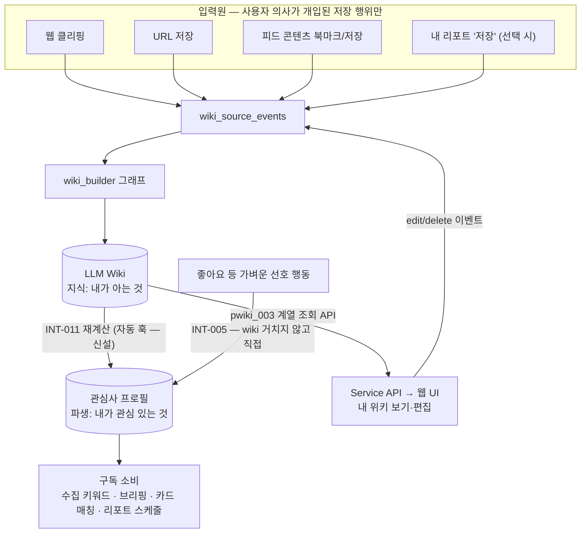

# 지식 파이프라인 설계 — 입력원 → LLM Wiki → 관심사 프로필 → 구독

> 상태: **제안 — 팀 협의 전** · 작성일 2026-07-27
> 목적: "사용자 행동이 어떻게 지식(Wiki)이 되고, 지식이 어떻게 관심사가 되며, 관심사가 어떻게
> 매일 받아보는 콘텐츠가 되는가"의 전체 데이터 흐름과 편집 정책을 확정하기 위한 설계 문서.
> 배경 논의: [agent-structure-and-collection-loop.md](agent-structure-and-collection-loop.md) (구조 진단),
> [assistant-split-proposal.md](assistant-split-proposal.md) (수집 정리 방향).
> 아래 내용 중 "확인됨"은 코드·스키마로 검증한 사실이고, "결정 필요"는 팀이 정해야 하는 항목이다.

---

## 1. 전체 그림

층위가 세 개다. 각 층위는 편집 수단과 의미가 다르다:

| 층위 | 답하는 질문 | 사용자 편집 수단 | 저장 위치 |
|---|---|---|---|
| **LLM Wiki** | 내가 무엇을 아는가 (지식) | 위키 편집 (노드 삭제·수정·메모) | `wiki_documents` (+versions) |
| **관심사 프로필** | 내가 무엇에 관심 있는가 (파생) | 직접 편집 없음 — wiki와 행동에서 재계산 | `user_interest_profiles`·`user_interests` |
| **구독 정책** | 매일 무엇을 받아볼 것인가 (정책) | 관심사 차단/해제 | `is_blocked`·`blocked_interest_ids` |

**위키 편집과 관심사(구독) 편집은 별개다.** wiki에서 노드를 삭제하면 다음 재계산 때 관련 topic 점수가 자연히 낮아진다(단방향 파생). 반대로 관심사를 차단해도 wiki 지식은 그대로 남는다. UI도 "내 위키" 화면과 "관심사 관리" 화면을 분리한다.

## 2. 원칙 5개

1. **입력원 원칙 — 사용자 의사가 개입된 저장 행위만 wiki가 된다.**
   자동 생성물의 무단 편입은 금지다. REPORT-021 "자동 Wiki 편입 금지: 생성된 콘텐츠를 **사용자 선택 없이** 개인 Wiki에 넣지 않는다"(`agent/report_builder/features/safeguards.py`, 확인됨). 이유: 내 리포트가 자동으로 wiki에 들어가면 그것이 다음 리포트의 근거(P)가 되는 **자기 강화 루프**(환각 누적·관심사 에코 챔버)가 생긴다. 내 리포트는 사용자가 명시적으로 저장할 때만 ③과 같은 경로로 편입한다.
2. **신호는 두 갈래 — 강한 행동은 wiki 경유, 가벼운 선호는 프로필 직행.**
   저장·북마크(콘텐츠를 소유하려는 행동) → wiki 편입 → 재계산으로 관심사에 반영.
   좋아요(가벼운 선호 표시) → wiki 문서를 만들지 않고 `interest_evidence.source_event_id`로 프로필 점수에 직접 반영(INT-005). 좋아요마다 문서를 만드는 것은 과하고, 강도·최신성은 wiki 구조가 아니라 이벤트 신호의 속성이기 때문.
3. **파생은 단방향 — wiki → 프로필.**
   프로필은 wiki를 읽어(INT-001) 계산한 materialized view다. 역방향(프로필→wiki) 쓰기는 없다. 재계산은 wiki를 변경하지 않고 프로필만 새 버전으로 갱신한다(기존 active → retired, `wiki_version_id`로 계산 기준 스냅샷 기록).
4. **편집도 이벤트로 — wiki 문서 직접 UPDATE 금지.**
   사용자 편집(수정·메모·삭제)은 `wiki_source_events`의 `edit`/`memo`/`delete` 이벤트로 들어와 build 파이프라인을 거쳐 반영한다. 버전 관리·멱등성·감사 추적이 유지되는 유일한 방법이며, 스키마가 이 이벤트 타입들을 이미 정의해 둔 이유다(확인됨).
5. **삭제·권한 정책의 판단은 Service 소유.**
   루트 CLAUDE.md 규칙("삭제/비공개/권한 정책은 Service Layer 기준"). Service가 정책을 결정하고 Agent(WBA-015)는 실행한다.

## 3. 입력원 정리 (검증 결과)

| # | 입력원 | 이벤트 타입 | 상태 |
|---|---|---|---|
| ① | 웹 클리핑 | `web_clipping` | 편입 파이프라인 구현됨 (wiki build Job) |
| ② | URL 저장 | `url` | 〃 |
| ③ | 피드 콘텐츠 북마크/저장 (다른 사용자 리포트 포함) | `content_save` / `content_mark` | 이벤트 타입만 정의됨 — 편입 파이프라인 미구현 |
| ④ | 내 리포트 | ③으로 흡수 — **사용자가 저장할 때만** | REPORT-021 원칙 (자동 편입 금지) 확인됨 |
| — | 좋아요 | wiki 입력원 아님 → 관심사 신호(INT-005) | 스키마 준비·미구현 |
| — | 편집·메모·삭제 | `edit` / `memo` / `delete` | 이벤트 타입만 정의됨 — WBA-015 스텁 |

## 4. 사용자 대면 기능 설계

### 4.1 내 위키 보기 (조회)

- Agent에 Service용 조회 라우트가 이미 있다(확인됨): `pwiki_003`(그래프), `pwiki_003_top_nodes`, `pwiki_003_list`, `pwiki_003_detail`, `pwiki_006_detail`(빌드 버전 구성) — `app/routers/service/routes.py`.
- 남은 일은 Service(Spring) 클라이언트 연동과 웹 UI다. 아키텍처 불변식 유지: Frontend → Service API → Agent API (agent-db 직접 접근 금지).

### 4.2 내 위키 편집 (수정·메모·삭제)

흐름: 웹 UI → Service API(권한·정책 판단) → Agent에 `edit`/`memo`/`delete` 이벤트 발행 → build 파이프라인이 반영(WBA-015 구현) → 완료 후 프로필 자동 재계산.

구현 전 결정 필요 — **tombstone 의미론(D1)**: 사용자가 노드를 삭제한 뒤 새 클리핑에 같은 entity가 다시 등장하면?
- (a) **부활** — 삭제는 "현재 상태 제거"일 뿐, 새 증거가 오면 다시 만든다.
- (b) **억제(tombstone)** — 삭제는 "이 개념 문서화 금지" 선언, 재등장해도 만들지 않는다 (해제 UI 필요).
- (c) **절충** — 기본 부활 + "다시 만들지 않기" 옵션 제공.
결정하지 않으면 "지운 노드가 계속 되살아나는" UX 버그가 된다. append-only 병합 철학과의 충돌 지점이므로 팀 합의가 선행 조건이다.

## 5. 작업 항목 백로그

> 우선순위는 루트 CLAUDE.md 기준(좋아요·피드·수집은 P1 트랙)과 정합하게 배치.
> 소유 후보는 CLAUDE.md 역할표 기준의 제안일 뿐, 배정은 팀에서 확정한다.

### Track A — 프로필을 살아있게 (선행: 없음, 즉시 가능)

| ID | 작업 | 위치 | 비고 |
|---|---|---|---|
| A1 | **wiki build 완료 → INT-011 자동 재계산 훅** | agent-api (wiki build 완료 지점 또는 Job 완료 이벤트) | 프로필이 항상 wiki에 동기화되는 materialized view가 됨. 이 문서 전체의 전제 |
| A2 | 재계산 트리거의 운영 경로 마련 | agent-api | 현재 rebuild는 `/dev/` 라우트뿐 — A1로 대체되거나 Service용 라우트로 승격 |

### Track B — 행동 신호 (선행: A1)

| ID | 작업 | 위치 | 비고 |
|---|---|---|---|
| B1 | 행동 이벤트 계약 정의 — Service가 좋아요 이벤트를 Agent에 전달하는 API·스키마 | agent-contract.md + 양 레포 | 결정 D2 필요 |
| B2 | **INT-005 구현** — 행동 이벤트를 `interest_evidence.source_event_id`로 프로필 점수에 반영 (강도·최신성 가중) | agent-api `domain/interests` | 스키마 준비됨 |
| B3 | INT-002 서비스 분류 체계 매핑 | agent-api | 기존 미구현 항목, 카드 UI 분류가 필요해질 때 |

### Track C — 피드 콘텐츠 편입 (선행: 없음)

| ID | 작업 | 위치 | 비고 |
|---|---|---|---|
| C1 | `content_save`/`content_mark` 이벤트 수신 → wiki build Job 발행 파이프라인 | agent-api | 기존 build Job 재사용 — 이벤트 수신부만 신설 |
| C2 | Service: 피드 북마크·"내 리포트 저장" 시 이벤트 발행 | service-api | REPORT-021 원칙 준수 — 자동 발행 금지, 사용자 액션 시에만 |

### Track D — 위키 보기·편집 (선행: D1 결정)

| ID | 작업 | 위치 | 비고 |
|---|---|---|---|
| D-0 | **결정 D1: tombstone 의미론** | 팀 회의 | Track D 전체의 선행 조건 |
| D-1 | Service의 wiki 조회 연동 (pwiki_003 계열 호출) + 웹 UI "내 위키" | service-api · service-web | Agent 라우트는 이미 존재 |
| D-2 | 편집 이벤트 파이프라인 — edit/memo/delete 수신 → 반영, **WBA-015 구현** | agent-api | 원칙 4 (직접 UPDATE 금지) |
| D-3 | 편집 후 재계산 연동 (A1 훅 재사용) | agent-api | 삭제 노드의 관심사 자연 하락 |
| D-4 | 관심사 차단 UI (구독 정책 편집 — 위키 편집과 별도 화면) | service-web | `is_blocked`·`blocked_interest_ids` 활용 |

## 6. 결정 필요 사항 (팀)

| ID | 결정 | 선택지 | 영향 |
|---|---|---|---|
| D1 | 삭제 tombstone 의미론 | 부활 / 억제 / 절충(기본 부활+옵션) | Track D 전체, UX |
| D2 | 좋아요 신호의 가중치·시간 감쇠 설계 | INT-005 파라미터 (예: 좋아요 +0.5, 반감기 14일 등) | 프로필 점수 품질, bench 대상 |
| D3 | "내 리포트 저장" UX | 명시적 저장 버튼 / 저장 제안 프롬프트 | REPORT-021 원칙 내에서의 형태 |
| D4 | 편집·행동 이벤트의 Service↔Agent 계약 | agent-contract.md 확장 범위 | 소라(Gateway)·영현(북마크 도메인) 협의 |

## 7. Service 연동 API 구현 계획 (Swagger 노출 기준)

> 현재 라우터 전수 조사 결과(2026-07-27, `app/routers/service/routes.py` · `service_worker/routes.py`)를
> "이미 있음 / 보강 / 신설"로 구분한 실행 계획. Phase 순서 = 의존성·리스크 낮은 순.

### 현재 이미 Swagger에 있는 것 (Spring은 호출만 하면 됨)

| operation_id | 경로 | 역할 |
|---|---|---|
| svc_001 | `PUT /users/{id}/context` | 사용자 컨텍스트 반영 — **blocked_interest_ids(관심사 차단) 포함** → 구독 정책 전달 경로 존재 |
| svc_002 / svc_003 | `POST /users/{id}/wiki-sources/clippings` · `/urls` | 클리핑·URL → Personal Wiki Build Job 등록 (202) |
| pwiki_003 계열 5종 | `GET .../personal-wiki/*` | Wiki Graph·상위 Node·문서 목록·상세·Build 상세 조회 |
| int_001_get | `GET /users/{id}/interests` | 활성 관심 Profile 조회 |
| report_018_list/detail · svc_008 · svc_013/014 | 생성물 조회·생성 요청·Job 상태/결과 | 리포트 흐름 |
| sw_004 / sw_009 (+batch) | service-worker: Publish Snapshot Claim/ACK | 발행물 소비 |

### Phase 1 — Agent 변경 없이 연결 (Spring·Frontend 작업)

MockAgentClient → 실호출 전환: svc_002/003(저장 → Wiki), pwiki_003 계열("내 위키" 화면), int_001_get(관심사 표시), svc_001(차단 목록 반영). Spring Contract Test(AgentContextContractTest 패턴)에 계약 추가.

### Phase 2 — 프로필 자동화 (Track A, agent-api 소규모)

| 항목 | 형태 | 내용 |
|---|---|---|
| A1 재계산 훅 | 내부 (라우트 아님) | wiki build Job 완료 시 INT-011 실행. 편집(Phase 5) 완료 시에도 동일 훅 재사용 |
| A2 수동 재계산 승격 | `POST /users/{id}/interest-profiles/rebuild` (service 라우터, `int_011_rebuild`) | dev 전용 라우트를 운영 승격 — "관심사 새로고침" UX·복구용. 멱등 |
| (선택) 프로필 갱신 알림 | event_outbox `INTEREST_PROFILE_READY` + sw claim 확장 | Service가 폴링 대신 이벤트로 동기화. CONTENT_READY 패턴 재사용 |

### Phase 3 — 저장 편입 완성 (Track C)

| 항목 | 형태 | 내용 |
|---|---|---|
| svc_004 처리 구현 | 기존 라우트 보강 (현재 **접수 후 501**) | `content-marks`(내 생성 콘텐츠 위키마킹) → `wiki_source_events(content_mark)` → build Job. REPORT-021 원칙: Service가 사용자 액션 시에만 호출 |
| content-saves 신설 | `POST /users/{id}/wiki-sources/content-saves` | 피드에서 북마크한 타 사용자 콘텐츠 편입. 본문은 Service가 전달(클리핑과 동형) → `content_save` 이벤트 → build Job |

### Phase 4 — 행동 신호 (Track B, 결정 D2 선행)

| 항목 | 형태 | 내용 |
|---|---|---|
| 관심 신호 수신 신설 | `POST /users/{id}/interest-signals` (batch 허용) | `[{signal_type: like/unlike/view, content_id, occurred_at, ...}]` → 이벤트 적재(`interest_evidence.source_event_id` 경로). **반영은 다음 재계산 시**(INT-005가 행동 항 가산) — 프로필=파생 뷰 원칙 유지 |

### Phase 5 — 위키 편집 (Track D, 결정 D1 선행)

기존 `wiki-sources/*` URL 체계를 그대로 확장한다 (모두 202 + Job, 원칙 4 "편집도 이벤트로"):

| 항목 | 형태 | 내용 |
|---|---|---|
| 편집 | `POST /users/{id}/wiki-sources/edits` | `edit` 이벤트 (document_key + 변경 내용) → build 파이프라인 반영 |
| 메모 | `POST /users/{id}/wiki-sources/memos` | `memo` 이벤트 |
| 삭제 | `POST /users/{id}/wiki-sources/deletions` | `delete` 이벤트 (+ tombstone 옵션 — D1 결정 반영), **WBA-015 구현** |

### 공통 체크리스트

- 계약 문서 동기화: agent-contract.md·service-integration-guide.md에 신설·보강 엔드포인트 반영 (L citation 갱신과 함께)
- Spring Contract Test 추가 (기존 AgentContextContractTest 패턴)
- 편집 반영이 그래프 노드를 추가하면 /dev/graphs 레지스트리·가드 테스트 갱신 (AGENTS.md 규칙 10)
- INT-005·편집 반영은 LLM 미사용(결정론)이면 tests만, LLM 사용 시 bench 신설 (규칙 8)

## 8. 기존 문서와의 관계

- [agent-structure-and-collection-loop.md](agent-structure-and-collection-loop.md) — 구조 진단(입구 문서). 이 문서는 그 §6 "결론"의 지식·관심사 축을 구체화한다.
- [assistant-split-proposal.md](assistant-split-proposal.md) — 수집 정리. 본 문서의 프로필(구독 키워드)이 그 문서의 수집 워커 키워드 소스가 된다(끊긴 링크 연결 시).
- [langgraph-agents-review-2026-07-26.md](langgraph-agents-review-2026-07-26.md) — 리뷰. wiki_builder 개선 항목과 Track A~D는 독립적으로 진행 가능.
- [llm-wiki-vault-structure.md](llm-wiki-vault-structure.md) — Vault 산출물 규격. 편집(D-2) 구현 시 문서 규격 준수 필요.
